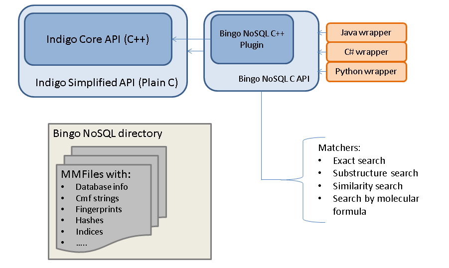
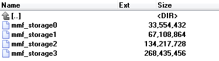

***********
Bingo NoSQL
***********

Overview
========

Bingo NoSQL is a Indigo plugin and non-relational database management system for storing chemical information and searching through it. With this plugin you can create databases which will be located on the hard drive of your local machine or some remote server. Bingo NoSQL uses only own and OS functionality for creating and accessing the databases, so there is no need in installing any additional third-party software. For storing chemical structures and other extra information memory-mapped files technology was used. This technology shows better performance than using direct read and write operations, so I/O delays have no significant effect on the Bingo NoSQL speed.

Structure
---------

|image0|

Matchers
--------

Next several search types have been implemented already:

-  Exact matching
-  Substructure matching
-  Similarity search
-  Search by molecular formula

Files
-----

Every database has form of the directory with set of files. Files sizes increase with increasing of the database, so Bingo NoSQL can be used as for working with small local sets of chemical structures, so as for large databases. 

|image1|

Scalability
-----------

Bingo NoSQL databases have multiple-readers/single-writer access type. Together with the possibility of a partial search through one database it allows to parallelize querying between different threads.

|image2|

License
-------

Licensed under the Apache License, Version 2.0 (the "License");
you may not use this file except in compliance with the License.
You may obtain a copy of the License at

    http://www.apache.org/licenses/LICENSE-2.0 

Unless required by applicable law or agreed to in writing, software
distributed under the License is distributed on an "AS IS" BASIS,
WITHOUT WARRANTIES OR CONDITIONS OF ANY KIND, either express or implied.
See the License for the specific language governing permissions and
limitations under the License.

Commercial Availability
-----------------------

If the GPL-licensed Bingo NoSQL does not fit your needs, please contact us to discuss the purchase of a commercial license.
You may need the commercial license if you want to:

-  Receive ongoing support and maintenance
-  Include Bingo NoSQL as a component in your proprietary software product

.. |image2| image:: ../assets/bingo/bingo_nosql_partial.png

Manuals
=======

.. toctree::
   :includehidden:
   :maxdepth: 3   

   installation-manual-nosql
   user-manual-nosql

