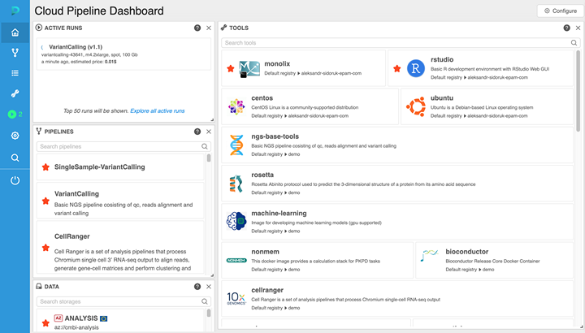
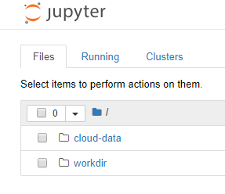
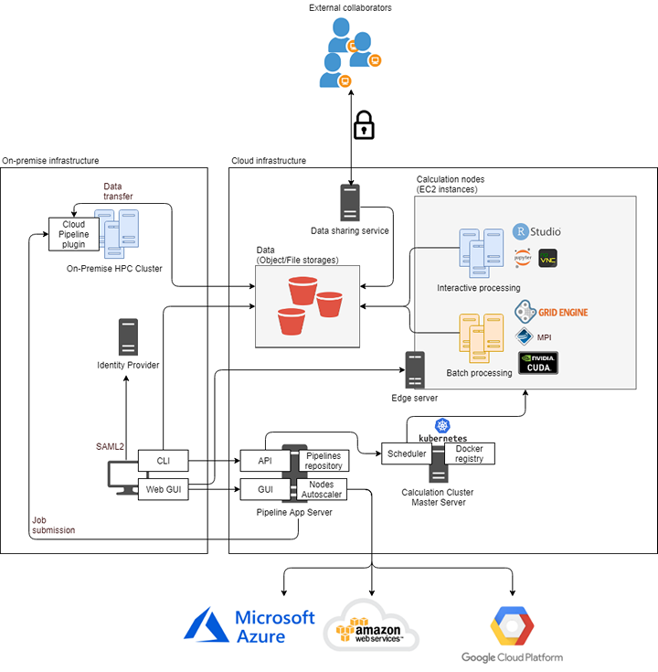

EPAM Cloud Pipeline
===================

..  raw:: html

    <link rel="stylesheet" href="../_static/css/bio-custom.css"/>

.. toctree::
    :hidden:
    :includehidden:

Overview
--------

EPAM Cloud Pipeline is a web-based Cloud environment that provides the ability to build & run the
customized scripts & workflows that support genomics analysis, modeling & simulation, and machine
learning activities that are required to accelerate drug discovery research.

Cloud Pipeline supports three main Cloud platforms:

- Amazon
- Azure
- Google

Cloud Pipeline solution wraps Cloud compute and storage resources into a single service, providing
an easy and scalable approach to accomplish a wide range of scientific tasks.

- Genomics data processing: create data processing pipelines and run them in the Cloud in the
  automated way. Each pipeline represents a workflow script with versioned source code,
  documentation, and configuration. Users can create such scripts in the Cloud Pipeline environment
  or upload them from the local machine.
- Data storage management: create data storage, download or upload data, edit files right in the
  Cloud Pipeline user interface. File version control is supported.
- Tools management: create and deploy shared and personal computation environment using Docker's
  container concept. Almost every pipeline requires a specific package of software to run it, which
  is defined in a docker image. So when user starts a pipeline, Cloud Pipeline starts a new cloud
  instance (node) and runs a docker image at it.
- Scientific computing GUI applications: launch and run GUI-based applications using self-service
  Web interface. It is possible to choose cloud instance configuration, or even use a cluster.
  Applications are launched as Docker containers exposing Web endpoints or a remote desktop
  connection (noVNC, NoMachine).

Cloud Pipeline provides a Web-based GUI and also supports CLI, which exposes most of the GUI
features.

Problems Addressed by Cloud Pipeline
------------------------------------

Many tasks in the Pharmaceutical R&D process require significant and constantly increasing
computational power and storage capacity. These tasks include:

- Genomic, transcriptomic, and other “omics” analysis
- PK/PD, QSP, and other types of modeling
- Clinical trials simulation
- AI/ML analysis in various areas, including the ones listed above, and many others.

Moving data storage and processing to the cloud is an obvious option, however certain challenges
specific to R&D processes must be addressed:

- Many R&D users, most of whom are scientists and not IT specialists, are not comfortable using
  cloud facilities directly (e.g. using command line interfaces and scripting languages).
- A few cloud-based offerings are available that offer Web UI to access data storage and pipeline
  building tools, however migrating pipelines from on premise to these platforms requires
  significant rework of existing workflows/scripts.
- 3rd party cloud-based offerings are often not flexible enough to support the wide variety of
  tools, frameworks and scripting languages found in build analytical/modeling pipelines
- Integration of cloud applications with on premise applications (hybrid architecture) is often
  required; for example, when a database for annotating genes and pathways, or a license server for
  certain software is installed on premise.
- Integration with an enterprise’s user management/authentication system is usually a requirement,
  and using SSO (Single Sign-On) mechanism is a great benefit for users.
- Scientists and researchers need access to a scalable computational cluster to solve their most
  compute intensive tasks, while at the same time reliable mechanisms are needed to control cloud
  spending.

Product Description
-------------------

Cloud Pipeline is an Open Source platform that provides the following features and capabilities:

- Powerful, user-friendly Web interface

- Support for multiple bioinformatics and modeling/simulation tools from an extensive library of
  Docker container images that are executed on cloud instances or clusters.
- Users can access active instances via Web based SSH connection, execute scripts, modify images by
  installing software packages, and commit modified images to the user’s personal repository.

- Ability to launch and manage interactive tools and applications with Web or Linux Desktop UIs.

- Users can build custom pipelines using a mixture of languages (including shell script, Python, R,
  Java, Perl, WDL, etc.), and save them to a built-in, version-controlled GitLab repository.

..  image:: ../assets/cloud/cloud-wdl.png
    :align: center

- Ability to create cloud storage units that upload and download data using a Web UI, Command Line
  interface (CLI) or by mounting storage folders to local Windows/Linux/Mac workstations.
- Ability to store and process data in multiple cloud regions.

..  image:: ../assets/cloud/cloud-region.png
    :align: center

- Management of data access permissions for both internal and external users.
- Support for thousands of users, utilizing thousands of nodes, and tens thousands of cores
  simultaneously. 
- Support for single/multiple computation node configurations, as well as auto-scaled SGE clusters,
  MPI-based clusters, various CPU/GPU/Memory/Disks configurations.

..  image:: ../assets/cloud/cloud-config.png
    :align: center

- Protecting data using data-at-rest and data-in-motion encryption.

Cloud Pipeline's Innovative Technology
--------------------------------------

- A key innovation is providing users with a self-service environment where they can flexibly build
  and execute their own pipelines/models, while preserving the highest levels of safety for the
  data and application.
- Users can choose the cloud instance configuration and region and request launching a regular or
  auto-scaled cluster without being a cloud or IT expert.
- Cloud Pipeline has a cloud-independent architecture, which makes it simple to port the solution
  to various cloud platforms. Currently AWS, Azure, and GCP are supported.
- Cloud Pipeline uses Docker containers and the Kubernetes engine to orchestrate the execution of
  containerized applications. 
- Cloud Pipeline has been implemented as a Virtual Private Cloud solution, that retains control
  over network connections and provides security and integration mechanisms for the enterprise’s
  IT/Security team. 
- Integration with on premise clusters and applications, as well as with external clouds is fully
  supported.
- The platform also can host/execute Web-based applications tightly integrated with computation and
  storage facilities, and security mechanisms.
- A powerful API allows external applications to leverage Cloud Pipeline’s tools, storage, clusters
  and instances to perform the computational work and retrieve the result data for further
  processing.

Source code
-----------

Cloud Pipeline source code, documentation, guides how to build and start are accessible
`at GitHub. <https://github.com/epam/cloud-pipeline>`__

License
-------

Copyright 2017-2019 `EPAM Systems, Inc. <https://www.epam.com/>`__

Licensed under the Apache License, Version 2.0 (the "License");
you may not use this file except in compliance with the License.
You may obtain a copy of the License at

    http://www.apache.org/licenses/LICENSE-2.0 

Unless required by applicable law or agreed to in writing, software
distributed under the License is distributed on an "AS IS" BASIS,
WITHOUT WARRANTIES OR CONDITIONS OF ANY KIND, either express or implied.
See the License for the specific language governing permissions and
limitations under the License.

Feedback
--------

Do you need help in implementing Cloud Pipeline? Do you need a feature? Did you find a bug?
`Report issues at GitHub <https://github.com/epam/cloud-pipeline/issues>`__
or contact us: ECP@epam.com
