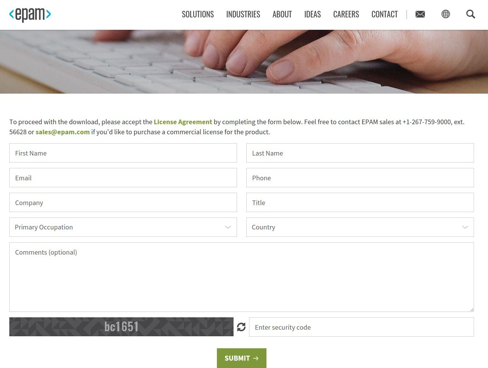

Downloads
=========

.. toctree::
    :hidden:

    index
    bingo
    ketcher
    Indigo <indigo/index>
    Indigo ELN <indigo/eln>
    imago
    parso
    service

-  `Bingo <bingo.html>`__: Chemistry search engine for Oracle and MS SQL
   Server databases
-  `Ketcher <ketcher.html>`__: Web-based molecule sketcher
-  `Indigo Toolkit <indigo/index.html>`__: Universal cheminformatics
   toolkit and API
-  `Indigo ELN <indigo/eln.html>`__: Open-Source Chemistry Electronic
   Lab Notebook
-  `Imago OCR <imago.html>`__: Chemical optical recognition toolkit
-  `Parso <parso.html>`__: Open-Source SAS7BDAT datasets reader
-  `Indigo Service <service.html>`__: RESTful API for Indigo toolkit

Additional Services
-------------------

Visit the following pages if you need additional services or if you have any questions

Cheminformatics
^^^^^^^^^^^^^^^

-  `Bingo SolutionsHub <https://solutionshub.epam.com/solution/bingo>`__
-  `Ketcher SolutionsHub <https://solutionshub.epam.com/solution/ketcher>`__
-  `Indigo Toolkit SolutionsHub <https://solutionshub.epam.com/solution/indigo>`__
-  `Indigo ELN SolutionsHub <https://solutionshub.epam.com/solution/indigo-eln-2-0>`__
-  `Imago OCR SolutionsHub <https://solutionshub.epam.com/solution/imago>`__

Bioinformatics
^^^^^^^^^^^^^^

-  `NGB SolutionsHub <https://solutionshub.epam.com/solution/new-genome-browser-ngb>`__
-  `Miew SolutionsHub <https://solutionshub.epam.com/solution/miew>`__
-  `Med3web SolutionsHub <https://solutionshub.epam.com/solution/med-3-web>`__
-  `Cloud Pipeline SolutionsHub <https://solutionshub.epam.com/solution/cloud-pipeline>`__

Data processing
^^^^^^^^^^^^^^^

-  `Parso SolutionsHub <https://solutionshub.epam.com/solution/parso>`__

Software development
^^^^^^^^^^^^^^^^^^^^

-  `JDI Light SolutionsHub <https://solutionshub.epam.com/solution/jdi-light>`__
-  `JDI Dark SolutionsHub <https://solutionshub.epam.com/solution/jdi-dark>`__

User guide
----------

Open an appropriate product page and press **Request Solution** button

.. image:: ../assets/downloads/help/solutionshub_form1.png

|

Fill the form, select additional services, enter a *security code* and press **Send**. After some time all the necessary information will be sent to the specified e-mail.

|

First time download
-------------------

Open required project page. Select appropriate product, operating system and architecture. The download will redirect to the EPAM standard form

Fill the form, enter a *security code* and press **Submit**. After some time the **URL** will be sent to the specified e-mail.
``Note``: EPAM form uses cookies to store user information. The URL from e-mail should be opened in the **same browser** which was used to fulfill the form. 
If you download a product second time or if you want to download a new product, you do not have to submit the form second time. After selecting URL the completed form will appear. And the **Download** button will be added.

.. image:: ../assets/downloads/help/form2.jpg

A file download process should be started once the **Download** button is pressed (no e-mails will be sent)
``Note``: please note that the second time the *Submit* button will send an e-mail **only** if the specified e-mail differs from the e-mail in the pre-filled form.

In case of problems
-------------------

If you have any issues please contact us by lifescience.opensource@epam.com

