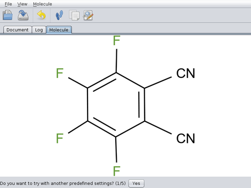
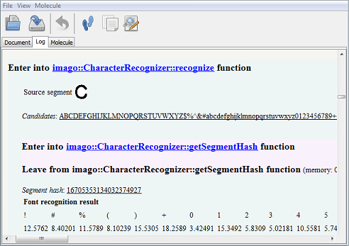

Imago OCR Visual Tool
=====================

Downloading and Running the Application
---------------------------------------

Look at the `Download <../download/index.html>`__ page for the package
suitable for your system. For Windows and Mac OS X, an installer
executable is provided. On Linux you just need to unpack the provided
zipfile and run the following command:

::

    java -jar /path/to/imago-gui.jar

You can also run the application without installing and downloading it
using Java Web Start technology. Open the `following
JNLP-file <http://www.epam.com/content/dam/epam/open-source/library/imago-2.0.0/jnlp/imago-ocr-visual-tool.jnlp>`__
to execute Imago OCR Visual Tool.

Distribution
------------

The ``imago-gui.jar`` file is included in the package for each
architecture. It doesn't have any depenent files. Binary dynamic
libraries are extracted from JAR files and loaded automatically.

Interface
---------

The interface is simple and straightforward. You can open an image
(PNG/JPEG/GIF) or a document (PDF/TIFF) and view in in the "Document"
tab:

|image0|

You can scale up the image (or the document page) and select the desired
structure with the mouse:

|image1|

Then you will see the selected structure:

|image2|

Soon after pressing the “Recognize” button, you will get the re-rendered
image with the recognized molecule:

|image3|

You can also see the application log to know what happened and how much
time it took:

|image4|

The “Save molecule” button brings up a dialog to save the resulting
molfile.

The “Open sketcher” button opens the resulting molfile in an external
application, that can be specified.

.. |image0| image:: ../assets/imago/ego-0.png
.. |image1| image:: ../assets/imago/ego-1.png
.. |image2| image:: ../assets/imago/ego-2.png

