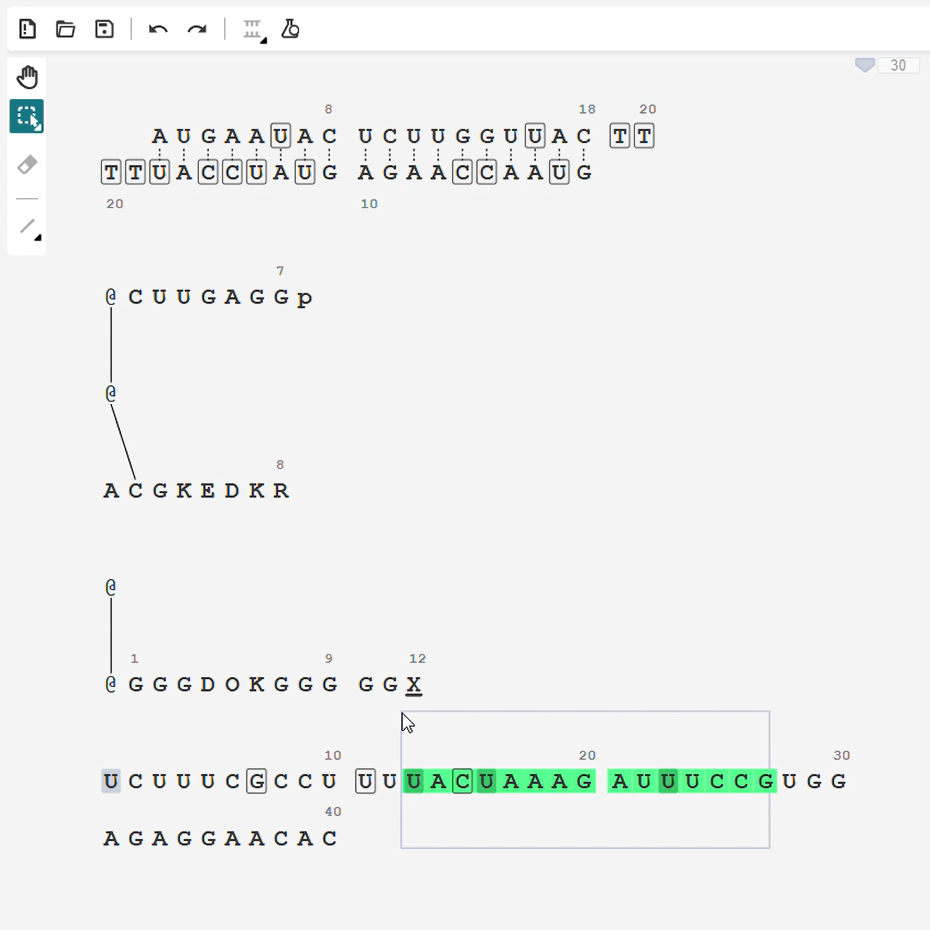
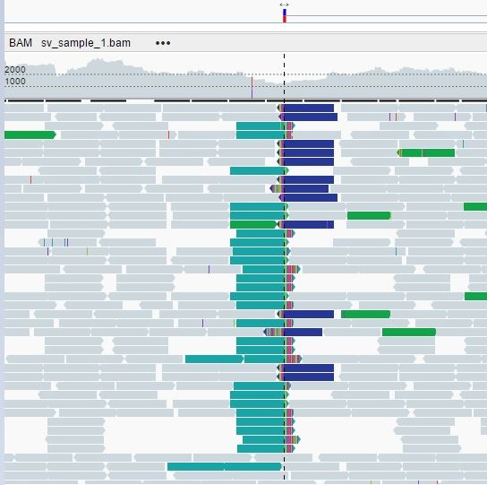

Life Sciences Open Source
=========================

.. toctree::
    :hidden:

    Bingo <bingo/index>
    NGB <ngb/index>
    Indigo Toolkit <indigo/index>
    Ketcher <ketcher/index>
    Indigo ELN <indigo/eln/index>
    Imago OCR <imago/index>
    Parso <parso>
    Selenium Framework <selenium>
    
Bioinformatics
--------------

-  `New Genome Browser <ngb/index.html>`__ Web at a speed and functionality of desktop |image8|

   -  Visualiszation of Alignments, Variations, Structural Variations
   -  Embedded Protein structure viewer 
   -  Integration with ENSEMBL, UniPROT, etc. and internal databases
   -  Fast access to huge (500 Gb and more) data files and to cloud data (Amazon S3, Hadoop, etc.)
   -  Try the `NGB demo <http://ngb.opensource.epam.com/catgenome>`__: Analize genome online

Cheminformatics
---------------

-  `Bingo <bingo/index.html>`__ Chemistry search engine for Oracle, Microsoft SQL Server and PostgreSQL databases |image1|

   -  Bingo is a RDBMS data cartridge that provides the industry's
      next-generation, fast, scalable, and efficient storage and searching
      solution for chemical information.
   -  Bingo seamlessly integrates the chemistry into Oracle, Microsoft SQL
      Server and PostgreSQL databases. Its extensible indexing is designed to
      enable scientists to store, index, and search chemical moieties
      alongside numbers and text within one underlying relational database
      server

-  `Ketcher <ketcher/index.html>`__ Web-based molecule sketcher |image2|

   -  Ketcher is a web-based chemical structure editor.
   -  Since Ketcher is written in pure Javascript, it incorporates high
      performance, good portability and light weight. You will not need any
      Java or Flash plugins to use it in your browser. Ketcher is completely
      free and open-source, while also available on a commercial basis.
   -  `Ketcher 2.0 demo <ketcher/demo.html>`__: Edit molecules online

-  `Indigo Toolkit <indigo/index.html>`__ Universal cheminformatics
   toolkit and API |image3|

   -  Indigo is a universal organic chemistry toolkit. It contains first-class
      tools for end users, as well as a documented `API <indigo/api/index.html>`__
      for developers. Indigo it is completely free and open-source, while also
      available on a commercial basis.
   -  Indigo-based command-line `utilities <indigo/index.html#command-line-utilities>`__
   -  Number of freely available cheminformatics `KNIME nodes <indigo/knime.html>`__
   -  Indigo-based `Java GUI applications <indigo/index.html#java-gui-utilities>`__

-  `Indigo ELN <indigo/eln/index.html>`__ Open-Source Chemistry Electronic Lab Notebook |image4|

   -  Indigo ELN allows scientists to prepare, plan, and analyze experiments,
      access relevant information, and develop new methods in the areas of
      synthetic chemistry, analytical chemistry, and process chemistry.
   -  Indigo ELN combines the best of both worlds: an application developed
      and refined at Pfizer and tested by thousands of chemists there, and an
      open-source application that is available at no cost.

-  `Imago OCR <imago/index.html>`__ Chemical optical recognition toolkit |image5|

   -  Imago OCR is a toolkit for 2D chemical structure image recognition. It
      contains a `GUI <imago/imago-gui.html>`__ program and a `command-line
      utility <imago/imago_console.html>`__, as well as a documented
      `API <imago/c.html>`__ for developers. Imago is completely free and
      open-source, while also available on a commercial basis.

   -  `Imago OCR demo <ketcher/demo.html>`__: Recognize molecule images online (use Ketcher `Recognize` button)

Data processing
---------------

-  `Parso <parso.html>`__ Parso Java library |image6|

   -  Parso is a lightweight Java library that is designed to read SAS7BDAT
      datasets. The Parso interfaces are analogous to those that belong to
      libraries designed to read table-storing files
   -  Despite its small size, the Parso library is the only
      full-featured open-source solution to process SAS7BDAT datasets

Software development
--------------------

-  `EPAM Selenium Framework <selenium.html>`__ Test automation using Selenium WebDriver |image7|
    
   -  Selenium Framework is a Java library developed for test automation
      using Selenium WebDriver. It is based on Maven structure and integrates
      with the TestNG testing framework. 
   -  Selenium Framework provides
      rapid test automation for Web applications and allows focusing on
      substantial test development instead of tiresome testware maintenance.

                                

.. |image3| image:: themes/lifescience-theme/static/images/pics/Indigo-Toolkit.jpg

.. |image5| image:: themes/lifescience-theme/static/images/pics/Imago-OCR.jpg
.. |image6| image:: themes/lifescience-theme/static/images/pics/Parso.jpg
.. |image7| image:: themes/lifescience-theme/static/images/pics/JDI.jpg

