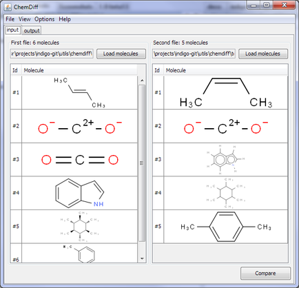
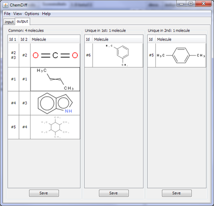
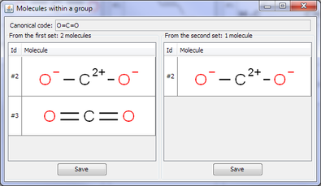
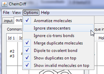

ChemDiff
========

Overview
--------

ChemDiff is an Indigo-based utility for finding duplications and visual
comparison of two files containing multiple structures. SDF, SMILES,
CML, MOLFILE input formats are supported. Files can contains large
amount of molecules and ChemDiff was test on files with up to 1 million
ones.

There are at least 3 possible use cases for ChemDiff:

#. Compare 2 sets of molecules.
#. Find duplicates in a single set of molecules.
#. Test whether a specified molecule (or some set of molecules) belongs
   to another set of molecules.

Screenshots
-----------

|image0| |image1|

Features
--------

ChemDiff window contains two tabs: first tab is for input molecules, and
second tab contains comparison result. To load set of molecules you need
to click corresponding button for the first set or for the second set.
After loading set of molecules ChemDiff asks what property should be
used as an identifier for the molecule. Example of such dialog is given
below. Table of possible properties contains name, serial number in the
file, and all properties associated with this molecule.

|image2|

When the "Compare" button is pressed, ChemDiff compares the specified
set of molecules and shows the results on the second tab:

|image3|

Any table cell can be opened by double click or by pressing right mouse
button:

|image4|

If a table cell contain multiple molecules then ChemDiff shows a
separate window with molecules from this group:

|image5|

If you double-click a molecule, you will see a separate window with this
molecule:

|image6|

There are different comparison options:

|image7|

If a molecule contains atoms with invalid valence or etc. then red mark
is shown. Details can be found by double-clicking this molecule:

|image8|

ChemDiff distribution includes a set of test files showing features of
molecules comparation.

More screenshots
----------------

|image9| |image10| |image11| |image12|

Portability
-----------

ChemDiff is written in Java and supports Linux and Windows operating
systems, both 32-bit and 64-bit versions of each system. Mac OS X 10.5
and 10.6 are supported as well. ChemDiff depends on the
`Indigo <index.html>`__ library. The binaries of Indigo for all
supported systems are included in the distribution.

Download and Install
--------------------

Look at the `Downloads <../download/index.html#utilities>`__ page for
package suitable for your system. For Windows, an installer executable
is provided. On Linux and Mac OS X, you just need to unpack the provided
zipfile and run the following command:

::

    /path/to/chemdiff-1.0-xxxx/chemdiff

You can also put the symlink in /usr/local/bin:

::

    sudo ln -s /path/to/chemdiff-1.0-xxxx/chemdiff /usr/local/bin

and then you will be able to run ChemDiff by typing ``chemdiff`` in the
command line.

License
-------

Copyright © 2011 LifeSciences unit of EPAM Systems, Inc.

This program is free software: You can redistribute it and/or modify it
under the terms of the GNU General Public License as published by the
Free Software Foundation; version 3 of the License.

This program is distributed in the hope that it will be useful, but
WITHOUT ANY WARRANTY; without even the implied warranty of
MERCHANTABILITY or FITNESS FOR A PARTICULAR PURPOSE. See the GNU General
Public License for more details.

You should have received a copy of the GNU General Public License along
with this program. If you did not not, please see
http://www.gnu.org/licenses/.

Commercial Availability
-----------------------

If GPL-licensed ChemDiff does not fit your needs, please contact us to discuss the purchase of a commercial license.
You may need the commercial license if you want to:

-  Receive ongoing support and maintenance
-  Include ChemDiff as a component in your proprietary software product

.. |image2| image:: ../assets/indigo/ChemDiff_Select_ID_field.png
.. |image3| image:: ../assets/indigo/ChemDiff_output.png
.. |image4| image:: ../assets/indigo/ChemDiff_context_menu.png

.. |image6| image:: ../assets/indigo/ChemDiff_single_molecule.png

.. |image8| image:: ../assets/indigo/ChemDiff_error.png
.. |image9| image:: ../assets/indigo/ChemDiff_shot1_small-1.png
.. |image10| image:: ../assets/indigo/ChemDiff_shot2_small-1.png
.. |image11| image:: ../assets/indigo/ChemDiff_large_set_in.png
.. |image12| image:: ../assets/indigo/ChemDiff_large_set_out.png
