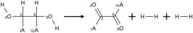

Transformation
==============

Examples
--------

Charge neutralization
~~~~~~~~~~~~~~~~~~~~~

+------------+
| Reaction   |
+============+
| |image1|   |
+------------+

+------------+
| Molecule   |
+============+
| |image3|   |
+------------+

+------------+
| Result     |
+============+
| |image5|   |
+------------+

Abbreviation expansion
~~~~~~~~~~~~~~~~~~~~~~

+------------+
| Reaction   |
+============+
| |image7|   |
+------------+

+------------+
| Molecule   |
+============+
| |image9|   |
+------------+

+-------------+
| Result      |
+=============+
| |image11|   |
+-------------+

Note: source molecule does not contain SGroups, TfO is specified as a
pseudoatom.

Abbreviation contraction
~~~~~~~~~~~~~~~~~~~~~~~~

+-------------+
| Reaction    |
+=============+
| |image13|   |
+-------------+

+-------------+
| Molecule    |
+=============+
| |image15|   |
+-------------+

+-------------+
| Result      |
+=============+
| |image17|   |
+-------------+

Other examples
~~~~~~~~~~~~~~

+--------------------------------------------------------------------------------------------------------------------------------+
| Reaction                                                                                                                       |
+================================================================================================================================+
| ``[*:1]-[#6:2]([H])(-[#8:4][H])-[#6:6]([H])(-[#8:8][H])-[*:10]>>[*:1]-[#6:2](=[#8:4])-[#6:6](=[#8:8])-[*:10].[H][H].[H][H]``   |
+--------------------------------------------------------------------------------------------------------------------------------+
| |image19|                                                                                                                      |
+--------------------------------------------------------------------------------------------------------------------------------+

+-------------+
| Molecule    |
+=============+
| |image21|   |
+-------------+

+-------------+
| Result      |
+=============+
| |image23|   |
+-------------+

.. |image0| image:: ../../assets/indigo/concepts/transform_ex4_rxn.svg
.. |image1| image:: ../../assets/indigo/concepts/transform_ex4_rxn.svg

.. |image4| image:: ../../assets/indigo/concepts/transform_ex4_result.svg
.. |image5| image:: ../../assets/indigo/concepts/transform_ex4_result.svg
.. |image6| image:: ../../assets/indigo/concepts/transform_ex2_rxn.svg
.. |image7| image:: ../../assets/indigo/concepts/transform_ex2_rxn.svg
.. |image8| image:: ../../assets/indigo/concepts/transform_ex2_mol.svg
.. |image9| image:: ../../assets/indigo/concepts/transform_ex2_mol.svg

.. |image12| image:: ../../assets/indigo/concepts/transform_ex3_rxn.svg
.. |image13| image:: ../../assets/indigo/concepts/transform_ex3_rxn.svg

.. |image16| image:: ../../assets/indigo/concepts/transform_ex3_result.svg
.. |image17| image:: ../../assets/indigo/concepts/transform_ex3_result.svg

.. |image20| image:: ../../assets/indigo/concepts/transform_ex1_mol.svg
.. |image21| image:: ../../assets/indigo/concepts/transform_ex1_mol.svg
.. |image22| image:: ../../assets/indigo/concepts/transform_ex1_result.svg
.. |image23| image:: ../../assets/indigo/concepts/transform_ex1_result.svg
