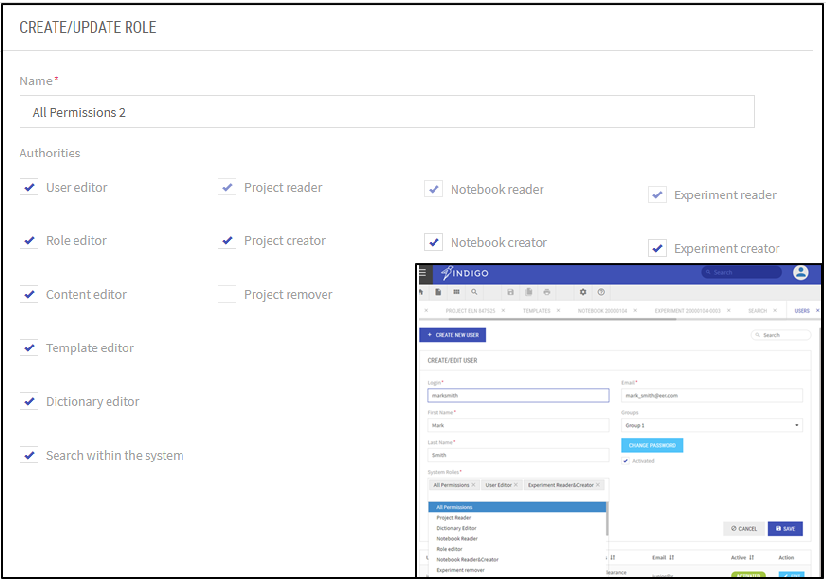
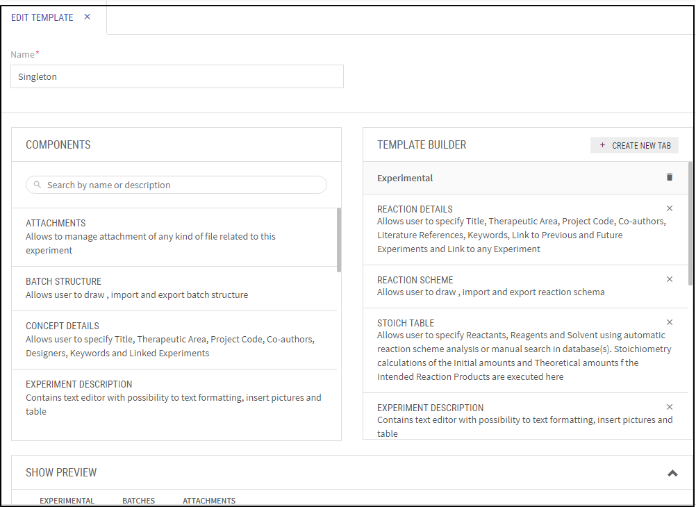
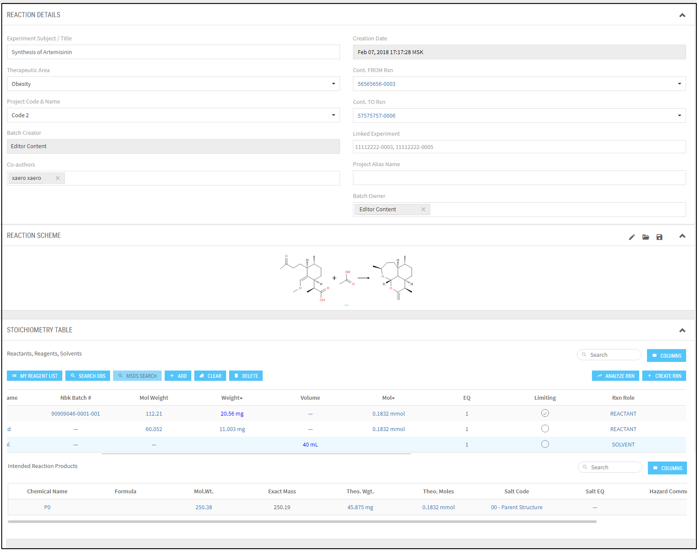
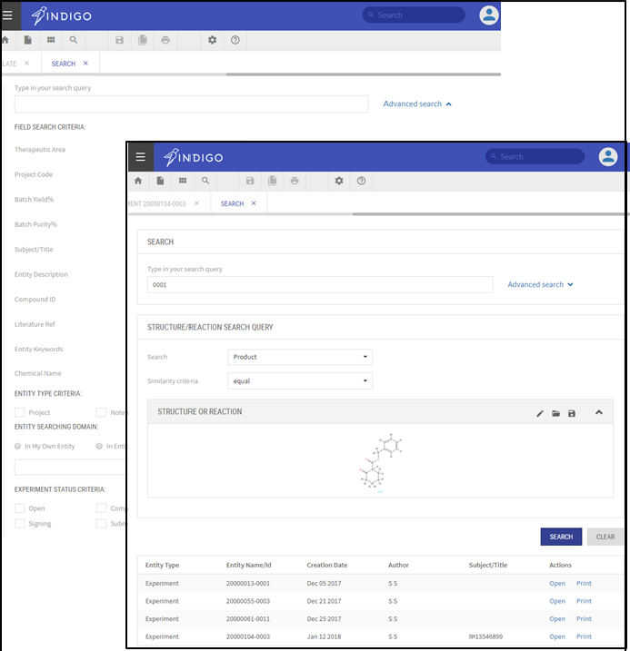
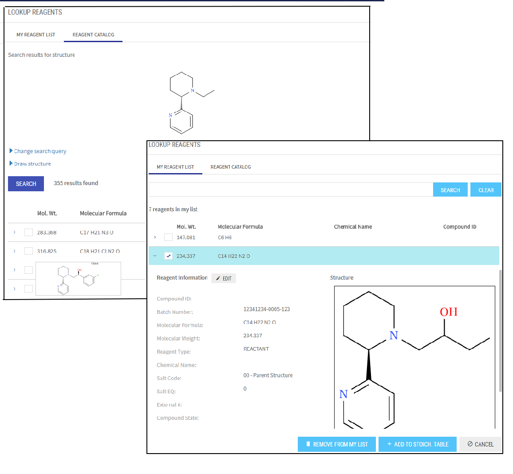
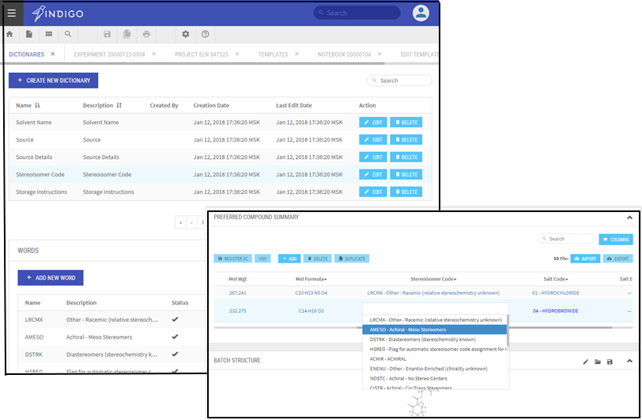

Indigo ELN v2.0: The Open-Source Electronic Lab Notebook
========================================================

.. toctree::
    :hidden:
    :includehidden:

    changelog
    

Professional. Proven. Free

Overview
--------

Indigo ELN provides scientists with a proven way to create, store, retrieve, and share electronic records of chemistry information in ways that meet all legal, regulatory, technical, and scientific requirements.
The new Indigo ELN provides rich capabilities for customization and integration with customer services. An important new feature is the flexibility to adjust Indigo ELN to custom needs in terms of user access policy, integration with existing databases, and registration with electronic signature services. The new mechanism of templates allows creating various types of experiments using the current component library. New components can be included in the application without the need to change the core code.
Indigo ELN v 2.0 is the next version of EPAM open-source Indigo ELN based on a completely different technology stack than v.1.0 and providing a new interface, new features, at the same time retaining all the functionality previously implemented.

Indigo ELN is a viable free-of-charge alternative to commercial electronic notebooks providing the same set of functionality.

Why Select Indigo ELN as Your ELN?
----------------------------------

Cost benefits
~~~~~~~~~~~~~~~

- The core Indigo ELN product is free of charge, as it is distributed under open-source GNU General Public License, Version 3.
- Total integration costs are much less than the licensing costs of commercial products.
- Indigo ELN represents a leading cost-effective alternative to commercial ELN products.

Modern technologies
~~~~~~~~~~~~~~~~~~~

- Indigo ELN v2.0 is a Web-based solution with a multi-tier architecture. 

Integration with external systems
~~~~~~~~~~~~~~~~~~~~~~~~~~~~~~~~~

- The core Indigo ELN v2.0 product is shipped with basic services included. Integration with any  external service  requires just develop new component without   need to change core code and architecture.
- EPAM is available to implement any requested components, services and to integrate the solution into your infrastructure.
- Docker image is avaiable

Core Indigo ELN v2.0 Package
----------------------------

The core Indigo ELN package includes:

- Database tier - MongoDB (In addition, Indigo ELN supports EPAM`s open-source molecular search service BingoDB).
- Core user interface for creation of Projects, Notebooks, Experiment templates and Experiments.
- Integrated Ketcher (EPAM`s open-source editor) for structure editing

Major services:
~~~~~~~~~~~~~~~

- Basic functionality and user interfaces for creating, describing, searching and managing entities: template, experiments, notebook, projects.
- Reaction rendering and chemical properties calculation based on EPAM`s open-source cheminformatics engine Indigo.
- Integration with External Compound registration and structure search services
- APIs to integrate with existing customer services and databases 
- API to integrate with existing customer signature service ( if needed we can provide EPAM open-source signature service with web-based  UI)

EPAM`s Open-Source Products to Complement Indigo ELN
----------------------------------------------------

EPAM is available to integrate EPAM's open-source products and other open-source products with the core functionality of Indigo ELN. In this way, Indigo ELN becomes a full-featured solution:

- Search in the Indigo ELN database by using EPAM`s molecular search service BingoDB
- Integration with EPAM`s chemistry drawing tool Ketcher.
- Basic compound and batch registration service (These can be adapted to meet your requirements). 
- Service for integration with Signature application to sign and witness experiments using internal certificate. Integration with service   used SAFE BioPharma standard for signature  is also possible.

Key Features
-----------------------------------

Indigo ELN v2.0 provides the following immediate functionality:

- Web-based ELN functionality without using any proprietary services or commercial third-party products
- Extended user management system (users and roles, entities sharing)
- Hierarchy of logical and database entities (projects, notebooks, experiments, components)
- Mechanism of templates to create different types of experiments without the need to change the code
- Ability to prepare, plan, analyze experiments, access relevant information, export the information (print to PDF, export/import SDf)
- System search by different criteria including Product structure and reaction schema
- Integration with internal services and databases as well as with CRO/vendor/partner services

Manage Access Level
-------------------

Indigo ELN v2.0 supports User Access Management that allows refined customization of access levels for users and groups inside the whole system and to individual Projects, Notebooks and Experiments. To ensure this flexibility, Indigo ELN supports a User-Role-Authority model on application level and ACL (Access Control List) for entities (Project, Notebook, or Experiment) that contains User Permissions for a user. This means that Administrator can define which actions are allowed for a user on the application level. Users can share entities with various permission levels, and the visibility of such shared entities depends on user roles. Each user is assigned a role or a set of roles each containing a set of Authorities. The final set of privileges for a user is formed from a distinct set of authorities coping from all user's roles.

..  image:: ../../assets/eln/Indigo_Project_Members.png
    :align: center

Create Projects and Notebooks
--------------------------------

Hierarchy of entities consisting of projects, notebooks and experiments allows users to systemize their research work, provide additional information about ongoing projects and separate different topics inside one study.

..  image:: ../../assets/eln/Indigo_Project_Notebook.png
    :align: center

Flexible Experiment structure
-----------------------------------

Indigo ELN provides users with the ability to create custom templates for experiments to be able to suit numerous chemical research designs. Templates become available for many users to apply to their experiments. Experiment may include only experiment design or just a concept record, or both - all depends on the users` choice. Experiment Template can be constructed using components. The current components library allows supporting single step chemical reaction, future synthesis idea, including chemical structure information, or just a textual description. The list of components is expandable without the need to change the core code or architecture.

Search within system
---------------------------------

Entities search by attributes and Structure/Reaction search.
~~~~~~~~~~~~~~~~~~~~~~~~~~~~~~~~~~~~~~~~~~~~~~~~~~~~~~~~~~~~
Indigo ELN`s advanced algorithm for searching inside the system offers a wide range of queries: entity type and attribute, entity domain, experiment status. Integration with Bingo DB enables Experiment search by Product structure or Reaction scheme.

Reagent search in internal and external databases.
~~~~~~~~~~~~~~~~~~~~~~~~~~~~~~~~~~~~~~~~~~~~~~~~~~

Stoichiometry Table Component has Reagents Lookup Catalog functionality that provides search for Reactants, Reagents or Solvents created inside Indigo ELN database or in External databases integrated with Indigo ELN. Reagent search can be done by compound attributes such as IDs, compound state or by Structure. "My Reagent list" functionality is avaiable to ensure fast access to frequently used reagents in future experiments.

Create, describe and edit Batches. Compound Registration Service
----------------------------------------------------------------

Indigo ELN allows users to review, create, and edit Batches and Batch details:  Total Amount Made, Yield%, Stereoisomer code, Purity, Solubility, Hazards, etc. Batches can be added in several ways including Import from SDf option. Batches have unique IDs within the system and can be registered using Compound Registration Service, in which they are assigned Compound IDs.  EPAM can provide Compound Registration Service  along with Indigo ELN package or integrate the application with a customer service and its database. 

..  image:: ../../assets/eln/Indigo_Batches.png
    :align: center

Print Projects, Notebooks and Experiments
----------------------------------------------------------------

Users can print out the content of Project, Notebook and Experiment pages. Users can print out experiments contained in Notebooks as well as Projects and Experiments attached as .pdf files. The view of a printed version of an Experiment depends on its template, that is, the set of components it contains. The current components library provides a printed version for any component.

..  image:: ../../assets/eln/Indigo_Print.png
    :align: center

Create Dictionaries and customize your version of  Indigo ELN
----------------------------------------------------------------

Dictionaries collect items that appear in the drop-down lists of the application. Users can create and edit dictionaries in the Dictionaries tab. Dictionaries management is restricted by the corresponding authority in the user Role.

Support and Development
--------------------------
EPAM will provide you with customization, integration, support, and maintenance services for Indigo ELN and will price those services based on your individual needs.
Major factors affecting the service pricing include:
- Environment requirements (operating systems, existing services)
- Scope of services to be implemented or integrated
- User requirements (additional features or components to be developed for the core version).

Download and Installation
--------------------------

Please visit the GIT page for the installation package and documents.
For installation instructions, see the Installation Guide. For user manual, see User Guide.

Feedback
--------

Do you need assistance using our tools? Do you need a integration set up or new component development? Do you want to send a patch to us? Did you find a bug? 
Report issues to https://github.com/epam/Indigo-ELN-v.-2.0/issues or contact us: indigoeln@epam.com

License
-------

Copyright © 2010-2018 LifeSciences unit of EPAM Systems, Inc.

Indigo ELN v2.0 is free software: You can redistribute it and/or modify it under the terms of the GNU General Public License as published by the Free Software Foundation; version 3 of the License.
This program is distributed in the hope that it will be useful, but WITHOUT ANY WARRANTY; without even the implied warranty of MERCHANTABILITY or FITNESS FOR A PARTICULAR PURPOSE. See the GNU General Public License for more details.
You should receive a copy of the GNU General Public License along with this program. If you did not, please see http://www.gnu.org/licenses/