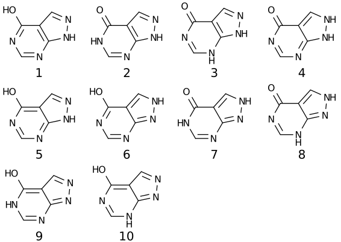
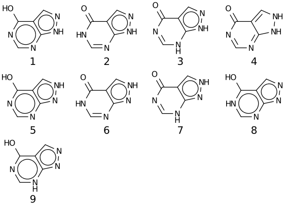
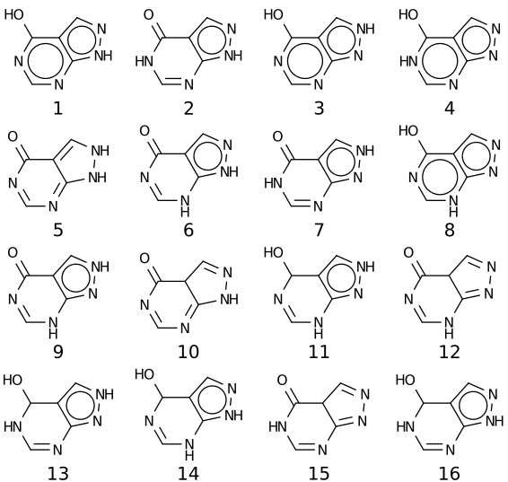
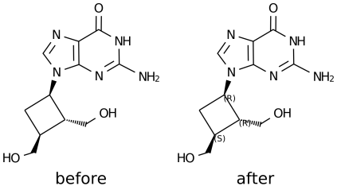
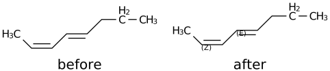
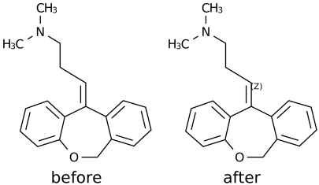
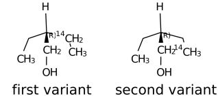
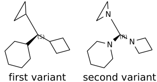

.. _indigo-example-calculating-properties:

======================
Calculating Properties
======================

This examples shows how to calculate different molecule and reaction properties

.. _indigo-example-canonical-smiles:

----------------
Canonical Smiles
----------------

The following code prints canonical smiles string for a given structure:

.. code-block:: python
    
    # indigo = Indigo()
    #
    # Load structure
    mol = indigo.loadMolecule('CC1=C(Cl)C=CC2=C1NS(=O)S2')

    #print canonical smiles for the molecule
    print(mol.canonicalSmiles())

Output:

.. code-block:: text

    CC1=C(Cl)C=CC2SS(=O)NC=21

The example below prints canonical smiles string for a given reaction:

.. code-block:: python

    # indigo = Indigo()
    #
    # Load structure
    rxn = indigo.loadReaction('[CH2:1]=[CH:2][CH:3]=[CH:4][CH2:5][H:6]>>[H:6][CH2:1][CH:2]=[CH:3][CH:4]=[CH2:5]')

    #print canonical smiles for the reaction
    print(rxn.canonicalSmiles())

Output:

.. code-block:: text

    [CH3:1][CH:3]=[CH:5][CH:4]=[CH2:2]>>[CH3:2][CH:4]=[CH:5][CH:3]=[CH2:1]

.. _indigo-example-tautomer-enumeration:

------------------------
Enumeration of Tautomers
------------------------

The following code prints the list of tautomers for a given molecule:

.. code-block:: python

    # indigo = Indigo()
    # indigoRenderer = IndigoRenderer(indigo)
    # 
    # Load structure
    molecule = indigo.loadMolecule('OC1C2C=NNC=2N=CN=1')

    #print the list of tautomers for the molecule
    iter = indigo.iterateTautomers(molecule, 'INCHI')
    lst = list()
    array = indigo.createArray()
    index = 1
    for imol in iter:
        mol = imol.clone()
        lst.append(mol.canonicalSmiles())
        mol.setProperty("grid-comment", str(index))
        array.arrayAdd(mol)
        index += 1

    lst.sort()
    print "\n".join(map(lambda x, y: str(x) + ") " + y, range(1, len(lst) + 1), lst))

    indigo.setOption("render-grid-margins", "20, 10")
    indigo.setOption("render-grid-title-offset", "5")
    indigo.setOption("render-grid-title-property", "grid-comment")
    indigoRenderer.renderGridToFile(array, None, 4, 'result.png')

Output:

.. code-block:: text

    1) O=C1N=CN=C2NNC=C21
    2) O=C1N=CNC2=NNC=C21
    3) O=C1N=CNC2NN=CC=21
    4) O=C1NC=NC2=NNC=C21
    5) O=C1NC=NC2NN=CC=21
    6) OC1=NC=NC2=NNC=C21
    7) OC1=NC=NC2NN=CC=21
    8) OC1N=CN=C2NN=CC2=1
    9) OC1N=CNC2=NN=CC2=1
    10) OC1NC=NC2=NN=CC2=1

If the molecule is aromatized before enumeration, the list of tautomers will be aromatized (if possible):

.. code-block:: python

    # indigo = Indigo()
    # indigoRenderer = IndigoRenderer(indigo)
    # 
    # Load structure
    molecule = indigo.loadMolecule('OC1C2C=NNC=2N=CN=1')
    molecule.aromatize()

    #print the list of tautomers for the molecule
    iter = indigo.iterateTautomers(molecule, 'INCHI')
    lst = list()
    array = indigo.createArray()
    index = 1
    for imol in iter:
        mol = imol.clone()
        lst.append(mol.canonicalSmiles())
        mol.setProperty("grid-comment", str(index))
        array.arrayAdd(mol)
        index += 1

    lst.sort()
    print "\n".join(map(lambda x, y: str(x) + ") " + y, range(1, len(lst) + 1), lst))

    indigo.setOption("render-grid-margins", "20, 10")
    indigo.setOption("render-grid-title-offset", "5")
    indigo.setOption("render-grid-title-property", "grid-comment")
    indigoRenderer.renderGridToFile(array, None, 4, 'result.png')

Output:

.. code-block:: text

    1) O=C1N=CN=C2NNC=C21
    2) O=C1N=CNc2[nH][n]cc21
    3) O=C1N=CNc2[n][nH]cc21
    4) O=C1NC=Nc2[nH][n]cc21
    5) O=C1NC=Nc2[n][nH]cc21
    6) Oc1[nH]c[n]c2[n][n]cc21
    7) Oc1[n]c[nH]c2[n][n]cc21
    8) Oc1[n]c[n]c2[nH][n]cc21
    9) Oc1[n]c[n]c2[n][nH]cc21

Please notice that the number of tautomers could be different in aromatized and dearomatized forms.
This happens because some aromatized forms could have different dearomatized representations.

The following code uses reaction SMARTS algorithm (may give different set of tautomers):

.. code-block:: python

    # indigo = Indigo()
    # indigoRenderer = IndigoRenderer(indigo)
    # 
    # Load structure
    molecule = indigo.loadMolecule('OC1C2C=NNC=2N=CN=1')
    molecule.aromatize()

    #print the list of tautomers for the molecule
    iter = indigo.iterateTautomers(molecule, 'RSMARTS')
    lst = list()
    array = indigo.createArray()
    index = 1
    for imol in iter:
        mol = imol.clone()
        lst.append(mol.canonicalSmiles())
        mol.setProperty("grid-comment", str(index))
        array.arrayAdd(mol)
        index += 1

    lst.sort()
    print "\n".join(map(lambda x, y: str(x) + ") " + y, range(1, len(lst) + 1), lst))

    indigo.setOption("render-grid-margins", "20, 10")
    indigo.setOption("render-grid-title-offset", "5")
    indigo.setOption("render-grid-title-property", "grid-comment")
    indigoRenderer.renderGridToFile(array, None, 4, 'result.png')

Output:

.. code-block:: text

    1) O=C1N=CN=C2NN=CC21
    2) O=C1N=CN=C2NNC=C21
    3) O=C1N=CNC2=NN=CC21
    4) O=C1N=CNc2[nH][n]cc21
    5) O=C1N=CNc2[n][nH]cc21
    6) O=C1NC=NC2=NN=CC21
    7) O=C1NC=Nc2[nH][n]cc21
    8) O=C1NC=Nc2[n][nH]cc21
    9) OC1N=CNc2[nH][n]cc21
    10) OC1N=CNc2[n][nH]cc21
    11) OC1NC=Nc2[nH][n]cc21
    12) OC1NC=Nc2[n][nH]cc21
    13) Oc1[nH]c[n]c2[n][n]cc21
    14) Oc1[n]c[nH]c2[n][n]cc21
    15) Oc1[n]c[n]c2[nH][n]cc21
    16) Oc1[n]c[n]c2[n][nH]cc21

.. _indigo-example-sgroups-search:

--------------
Sgroups search
--------------

The following code prints results of SGroups search requests with different criteria:

.. code-block:: python
    
    # indigo = Indigo()
    # 
    # Load structure
    indigo.setOption("molfile-saving-mode", "3000")
    file1 = "data/all_features_mol.mol"
    m = indigo.loadMoleculeFromFile(file1)

    sgs = m.findSGroups("SG_TYPE", "SUP")

    for sg in sgs:
       print("Superatom with label %s found" % (m.getSuperatom(sg.getSGroupIndex())).getSGroupName());

    sgs = m.findSGroups("SG_LABEL", "Z")
    print("SGroups with label Z:")
    for sg in sgs:
       print("SGroup Index = %d " % sg.getSGroupIndex() + ", SGroup Type = %s" % sg.getSGroupType());

    sgs = m.findSGroups("SG_CLASS", "AA")
    print("SGroups with class AA:")
    for sg in sgs:
       print("SGroup Index = %d " % sg.getSGroupIndex() + ", SGroup Type = %s" % sg.getSGroupType());

    sgs = m.findSGroups("SG_DISPLAY_OPTION", "0")
    print("SGroups expanded:")
    for sg in sgs:
       print("SGroup Index = %d " % sg.getSGroupIndex() + ", SGroup Type = %s" % sg.getSGroupType());

    sgs = m.findSGroups("SG_BRACKET_STYLE", "0")
    print("SGroups with square brackets:")
    for sg in sgs:
       print("SGroup Index = %d " % sg.getSGroupIndex() + ", SGroup Type = %s" % sg.getSGroupType());

    sgs = m.findSGroups("SG_DATA", "Selection")
    print("SGroups with data contains Selection:")
    for sg in sgs:
       print("SGroup Index = %d " % sg.getSGroupIndex() + ", SGroup Type = %s" % sg.getSGroupType());

    sgs = m.findSGroups("SG_DATA_NAME", "comment")
    print("SGroups with data field name comment:")
    for sg in sgs:
       print("SGroup Index = %d " % sg.getSGroupIndex() + ", SGroup Type = %s" % sg.getSGroupType());

    sgs = m.findSGroups("SG_DATA_DISPLAY", "detached")
    print("SGroups with detached data field:")
    for sg in sgs:
       print("SGroup Index = %d " % sg.getSGroupIndex() + ", SGroup Type = %s" % sg.getSGroupType());

    sgs = m.findSGroups("SG_DATA_LOCATION", "relative")
    print("SGroups with relative data field:")
    for sg in sgs:
       print("SGroup Index = %d " % sg.getSGroupIndex() + ", SGroup Type = %s" % sg.getSGroupType());

    sgs = m.findSGroups("SG_ATOMS", "103, 104")
    print("SGroups with atoms 103 and 104:")
    for sg in sgs:
       print("SGroup Index = %d " % sg.getSGroupIndex() + ", SGroup Type = %s" % sg.getSGroupType());

    sgs = m.findSGroups("SG_BONDS", "249, 245")
    print("SGroups with bonds 245 and 249:")
    for sg in sgs:
       print("SGroup Index = %d " % sg.getSGroupIndex() + ", SGroup Type = %s" % sg.getSGroupType());

Input: :download:`data/all_features_mol.mol`

Output:

.. code-block:: text

    Superatom with label PhN found
    SGroups with label Z:
    SGroup Index = 9 , SGroup Type = 3
    SGroup Index = 10 , SGroup Type = 3
    SGroups with class AA:
    SGroups expanded:
    SGroup Index = 0 , SGroup Type = 2
    SGroups with square brackets:
    SGroup Index = 0 , SGroup Type = 2
    SGroup Index = 1 , SGroup Type = 1
    SGroup Index = 2 , SGroup Type = 3
    SGroup Index = 3 , SGroup Type = 3
    SGroup Index = 4 , SGroup Type = 3
    SGroup Index = 5 , SGroup Type = 0
    SGroup Index = 6 , SGroup Type = 4
    SGroup Index = 7 , SGroup Type = 4
    SGroup Index = 8 , SGroup Type = 4
    SGroup Index = 9 , SGroup Type = 3
    SGroup Index = 10 , SGroup Type = 3
    SGroups with data contains Selection:
    SGroup Index = 1 , SGroup Type = 1
    SGroups with data field name comment:
    SGroup Index = 1 , SGroup Type = 1
    SGroups with detached data field:
    SGroup Index = 1 , SGroup Type = 1
    SGroups with relative data field:
    SGroup Index = 1 , SGroup Type = 1
    SGroups with atoms 103 and 104:
    SGroup Index = 3 , SGroup Type = 3
    SGroups with bonds 245 and 249:
    SGroup Index = 9 , SGroup Type = 3

.. _indigo-example-cip-descriptors:

---------------
CIP Descriptors
---------------

This examples show how to calculate CIP stereo descriptors for different molecules.
Descriptors calculation is activated by corresponding Indigo option ``molfile-saving-add-stereo-desc``
and descriptors are added into generated mol file as data S-groups with special name field
``INDIGO_CIP_DESC``. Setting Indigo option  ``molfile-saving-add-stereo-desc`` to 0 (or false) (the
default value) disables descriptors calculation and removes all such data S-groups during corresponding
mol file generation.

.. code-block:: python
    
    # indigo = Indigo()
    # indigoRenderer = IndigoRenderer(indigo)
    # 
    # Load structure
    file = "data/RS-example.mol"
    mol1 = indigo.loadMoleculeFromFile(file)
    mol2 = mol1.clone();

    indigo.setOption("molfile-saving-add-stereo-desc", "1");
    mol2.molfile()

    array = indigo.createArray()

    mol1.setProperty("grid-comment", "before")
    mol2.setProperty("grid-comment", "after")
    
    array.arrayAdd(mol1)
    array.arrayAdd(mol2)

    indigo.setOption("render-grid-title-property", "grid-comment")
    indigo.setOption("render-grid-margins", "20, 10")
    indigo.setOption("render-grid-title-offset", "10")

    indigoRenderer.renderGridToFile(array, None, 2, 'result.png')

Input: :download:`data/RS-example.mol`

.. code-block:: python
    
    # indigo = Indigo()
    # indigoRenderer = IndigoRenderer(indigo)
    # 
    # Load structure
    file = "data/ZE-example.mol"
    mol1 = indigo.loadMoleculeFromFile(file)
    mol2 = mol1.clone();

    indigo.setOption("molfile-saving-add-stereo-desc", "1");
    mol2.molfile()

    array = indigo.createArray()

    mol1.setProperty("grid-comment", "before")
    mol2.setProperty("grid-comment", "after")
    
    array.arrayAdd(mol1)
    array.arrayAdd(mol2)

    indigo.setOption("render-grid-title-property", "grid-comment")
    indigo.setOption("render-grid-margins", "20, 10")
    indigo.setOption("render-grid-title-offset", "10")

    indigoRenderer.renderGridToFile(array, None, 2, 'result.png')

Input: :download:`data/ZE-example.mol`

.. code-block:: python
    
    # indigo = Indigo()
    # indigoRenderer = IndigoRenderer(indigo)
    # 
    # Load structure
    file = "data/Z-example.mol"
    mol1 = indigo.loadMoleculeFromFile(file)
    mol2 = mol1.clone();

    indigo.setOption("molfile-saving-add-stereo-desc", "1");
    mol2.molfile()

    array = indigo.createArray()

    mol1.setProperty("grid-comment", "before")
    mol2.setProperty("grid-comment", "after")
    
    array.arrayAdd(mol1)
    array.arrayAdd(mol2)

    indigo.setOption("render-grid-title-property", "grid-comment")
    indigo.setOption("render-grid-margins", "20, 10")
    indigo.setOption("render-grid-title-offset", "10")

    indigoRenderer.renderGridToFile(array, None, 2, 'result.png')

Input: :download:`data/Z-example.mol`

There are also several examples for complicated structures when different software provides different
CIP stereo descriptors estimations:

The first case is the molecule with isotope inclusion.

.. code-block:: python
    
    # indigo = Indigo()
    # indigoRenderer = IndigoRenderer(indigo)
    # 
    # Load structure
    file1 = "data/C14_R_iso.mol"
    file2 = "data/C14_R_iso_2.mol"
    mol1 = indigo.loadMoleculeFromFile(file1)
    mol2 = indigo.loadMoleculeFromFile(file2)

    indigo.setOption("molfile-saving-add-stereo-desc", "1");
    mol1.molfile()
    mol2.molfile()

    array = indigo.createArray()

    mol1.setProperty("grid-comment", "first variant")
    mol2.setProperty("grid-comment", "second variant")
    
    array.arrayAdd(mol1)
    array.arrayAdd(mol2)

    indigo.setOption("render-grid-title-property", "grid-comment")
    indigo.setOption("render-grid-margins", "20, 10")
    indigo.setOption("render-grid-title-offset", "10")

    indigoRenderer.renderGridToFile(array, None, 2, 'result.png')

Input: :download:`data/C14_R_iso.mol`, :download:`data/C14_R_iso_2.mol`

The second case is the molecule with cyclic ligands and heterocycles.

.. code-block:: python
    
    # indigo = Indigo()
    # indigoRenderer = IndigoRenderer(indigo)
    # 
    # Load structure
    file1 = "data/P-92_2_1_3_ex1.mol"
    file2 = "data/P-92_2_1_3_ex2.mol"
    mol1 = indigo.loadMoleculeFromFile(file1)
    mol2 = indigo.loadMoleculeFromFile(file2)

    indigo.setOption("molfile-saving-add-stereo-desc", "1");
    mol1.molfile()
    mol2.molfile()

    array = indigo.createArray()

    mol1.setProperty("grid-comment", "first variant")
    mol2.setProperty("grid-comment", "second variant")
    
    array.arrayAdd(mol1)
    array.arrayAdd(mol2)

    indigo.setOption("render-grid-title-property", "grid-comment")
    indigo.setOption("render-grid-margins", "20, 10")
    indigo.setOption("render-grid-title-offset", "10")

    indigoRenderer.renderGridToFile(array, None, 2, 'result.png')

Input: :download:`data/P-92_2_1_3_ex1.mol`, :download:`data/P-92_2_1_3_ex2.mol`

