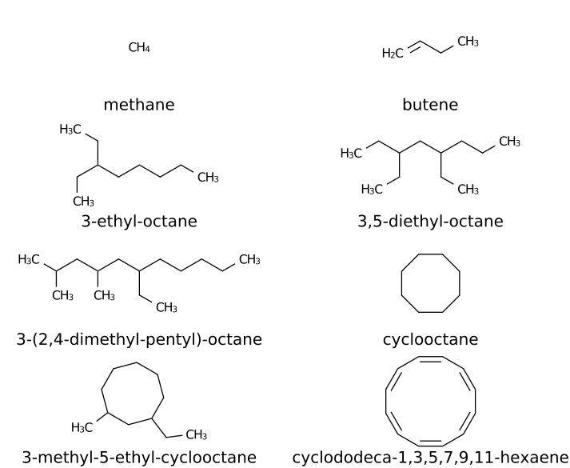
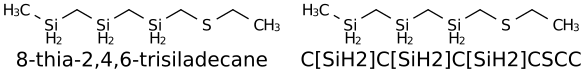

.. _indigo-example-name-to-structure:

Name To Structure
=================

Use nameToStructure
-------------------

Converting to structure using ``nameToStructure`` method

.. code-block:: python

    names = ["methane", "butene",
             "3-ethyl-octane", "3,5-diethyl-octane",
             "3-(2,4-dimethyl-pentyl)-octane", "cyclooctane", 
             "3-methyl-5-ethyl-cyclooctane", "cyclododeca-1,3,5,7,9,11-hexaene"]

    array = indigo.createArray()
    for n in names:
        mol = indigo.nameToStructure(n)
        mol.layout()
        mol.setProperty("grid-comment", n)
        array.arrayAdd(mol)
    
    indigo.setOption("render-grid-title-property", "grid-comment")
    indigo.setOption("render-grid-margins", "20, 10")
    indigo.setOption("render-grid-title-offset", "5")
    
    indigoRenderer.renderGridToFile(array, None, 2, 'result.png')

Use loadMolecule
----------------

Converting to structure using ``loadMolecule`` method (automatic detection)

.. code-block:: python

    names = ["8-thia-2,4,6-trisiladecane", "C[SiH2]C[SiH2]C[SiH2]CSCC"]

    array = indigo.createArray()
    for n in names:
        mol = indigo.loadMolecule(n)
        mol.layout()
        mol.setProperty("grid-comment", n)
        array.arrayAdd(mol)
    
    indigo.setOption("render-grid-title-property", "grid-comment")
    indigo.setOption("render-grid-margins", "20, 10")
    indigo.setOption("render-grid-title-offset", "5")
    
    indigoRenderer.renderGridToFile(array, None, 2, 'result.png')

