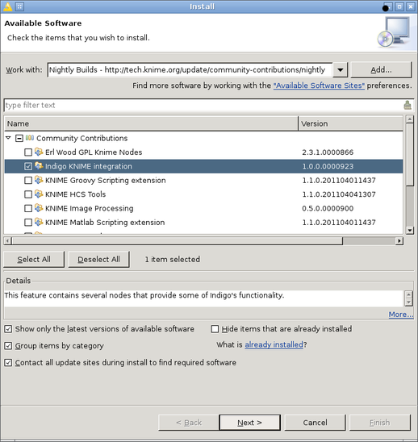
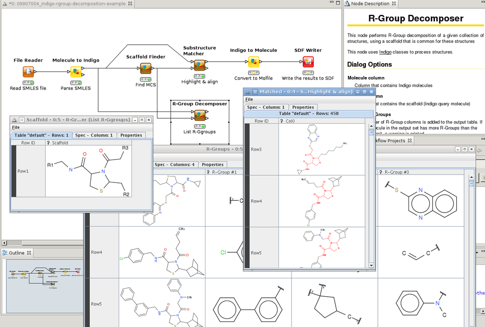
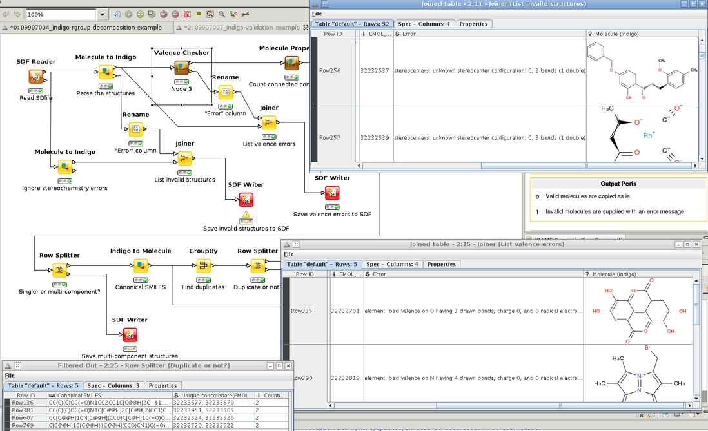

Nodes for KNIME
===============

Since May 2011, Indigo team provides cheminformatics nodes for KNIME. The overview of the nodes is
available at `KNIME Tech <http://tech.knime.org/community/indigo>`__.

Installation
------------

Prerequisites
~~~~~~~~~~~~~~

First, you need to add the `KNIME update
site <http://update.knime.org/analytics-platform/3.3/>`__ into your "software sites"
list, if it is not already there
(`instructions <http://www.knime.org/downloads/update>`__). From that
site, you need to download the *Base Chemistry Types & Nodes* (needed
for the Indigo nodes to work) and the *Distance Matrix* (needed for one
of the provided Indigo examples to work).

|image0|

Indigo Nodes
~~~~~~~~~~~~

You need to add the KNIME's `Community Contributions
Updates <http://update.knime.org/community-contributions/3.3>`__
site to tour "software sites" list
(`instructions <https://tech.knime.org/community>`__).
Then, you need to download the "Indigo KNIME Integration" package.

|image1|

"Unsigned Content" warning during the installation is OK, you can safely
ignore it.

After you successfully install the Indigo nodes and restart Eclipse, you
should be able to see the new nodes in the "Community Nodes/Indigo 2"
section. 

|image2|

Screenshots
-----------

R-Group Decomposition
~~~~~~~~~~~~~~~~~~~~~

|image3|

Structure Validation
~~~~~~~~~~~~~~~~~~~~

|image4|

Fingerprint-Based Clustering
~~~~~~~~~~~~~~~~~~~~~~~~~~~~

|image5|

Feedback
--------

You are welcome to post your bug-reports and suggestions about our KNIME
nodes to the `Indigo forum <http://tech.knime.org/forum/indigo>`__ at
the KNIME Tech. Topics related to the core Indigo library may, as
always, be posted into our `Google groups <../contact.html#feedback-on-open-source-software>`__.

.. |image0| image:: ../assets/indigo/knime-install-01.png

.. |image2| image:: ../assets/indigo/knime-install-03.png

.. |image5| image:: ../assets/indigo/knime-example-03.png
