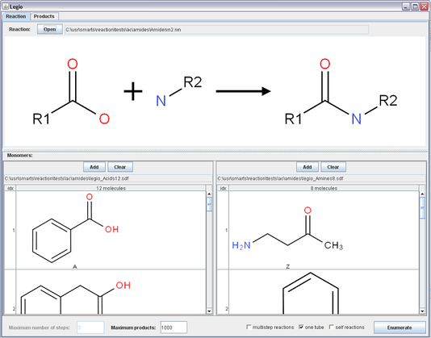

Legio
=====

Overview
--------

Legio is an Indigo-based GUI application that exposes the `combinatorial
chemistry <concepts/combichem.html>`__ capabilities of Indigo.

Screenshots
-----------

|image0| |image1|

Options Description
-------------------

If no options are specified, all reactions are performed in the “plate”
mode. This mode is also called the “grid mode”. It models the microtiter
plate, where every well of the plate contains exactly one monomer from
each group. When the reaction has two reactants, the reaction matrix is
a simple 2D table (square). When there are three reactants, the matrix
is a 3D table (cube), and so on.

When the “all reactions” flag is specified, the reaction can be repeated
with reaction products as monomers, but only within one well. Monomers
and products from different wells are independent and are never mixed.

With the enabled “one tube” option all monomers are placed into one
reaction vessel, and monomers from the same list of monomers can react.

Additionally, the “self reactions” option enables intramolecular
reactions, where one molecule of monomers can play the role of two (or
more) reactants.

Portability
-----------

Legio is written in Java and supports Linux and Windows operating
systems, both 32-bit and 64-bit versions of each system. Mac OS X 10.5
and 10.6 are supported as well. Legio depends on (and is based on) the
`Indigo <index.html>`__ library. The binaries of Indigo for all
supported systems are included in the distribution.

Download and Install
--------------------

Look at the `Downloads <../download/index.html>`__ page for the package
suitable for your system. For Windows, an installer executable is
provided. On Linux and Mac OS X, you just need to unpack the provided
zipfile and run the following command:

::

    /path/to/legio-1.0-xxxx/legio

You can also put the symlink in /usr/local/bin:

::

    sudo ln -s /path/to/legio-1.0-xxxx/legio /usr/local/bin

and then you will be able to run Legio by typing ``legio`` in the
command line.

License
-------

Copyright © 2010 GGA Software Services LLC

This program is free software: You can redistribute it and/or modify it
under the terms of the GNU General Public License as published by the
Free Software Foundation; version 3 of the License.

This program is distributed in the hope that it will be useful, but
WITHOUT ANY WARRANTY; without even the implied warranty of
MERCHANTABILITY or FITNESS FOR A PARTICULAR PURPOSE. See the GNU General
Public License for more details.

You should have received a copy of the GNU General Public License along
with this program. If you did not, please see
http://www.gnu.org/licenses/.

Commercial Availability
-----------------------

If the GPL-licensed Legio does not fit your needs, please contact us to discuss the purchase of a commercial license.
You may need the commercial license if you want to:

-  Receive ongoing support and maintenance.
-  Include Legio as a component in your proprietary software product.

.. |image1| image:: ../assets/indigo/legio_res.png
