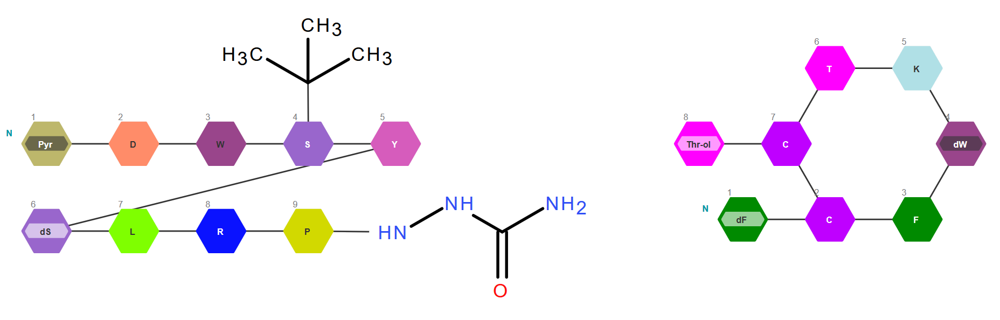
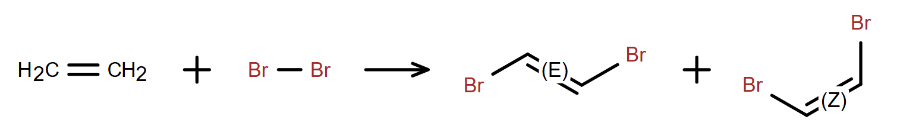
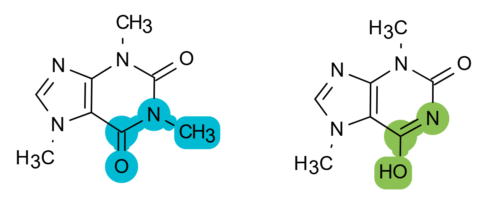
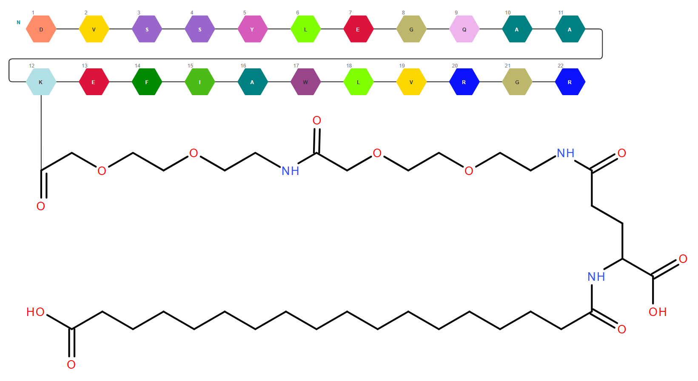
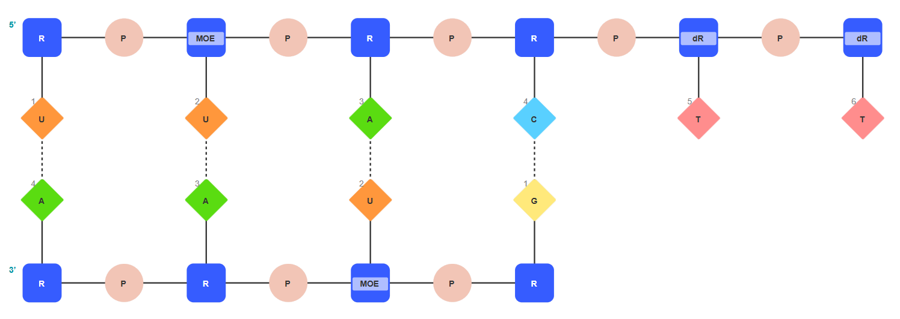

Ketcher
=======

.. toctree::
  :hidden:
  :includehidden:

  release-notes/index

Ketcher is an open-source web-based chemical structure editor designed for drawing small molecules, biomolecules, and chemical reactions. Using Ketcher, chemists, biochemists, technicians, academics, students, and any other chemistry aficionados, are able to easily:

- Draw small molecules, reactions, and biomolecules in-browser;

- Export their drawing into all common file formats for storing and sharing;

- Export as PNG/SVG for use in publications and presentations.

`Try Ketcher! <https://lifescience.opensource.epam.com/KetcherDemo/index.html>`_

|Ketcher-Introduction|

Main features
----------------------------------

- **Support for Reactions** - Full-featured reaction support including reaction centers, reaction flags, reaction mapping, ability to add catalysts, reaction conditions, and other information.

- **Stereochemistry Support** - Stereocenters can automatically be assigned a stereo-label of R/S, r/s, or E/Z, or in case of ambiguous configuration, marked with AND and OR groups.

|Reactions-and-setereochem|

- **Support for S-groups and R-groups** - All major S-Group types are supported including generic, SRU polymers, multiple groups, superatoms, and data S-Groups. R-group support includes: R-Sites and R-Fragments, as well as attachment point specification and R-Logic.

- **Structure Appearance Customization** – Easy way of changing the drawing style from the Ketcher default to the American Chemical Society (ACS) standard. Users can modify the appearance of their drawing by highlighting elements, or by changing parameters such as bond length, atom color, etc.

|ACS|

- **Support for all Common File Formats** – In addition to Ketcher’s own file format – KET that supports all available features, many other formats are supported: MDL Molfiles/SCSR (v2000 and v3000), SDF, RDF, SMARTS, SMILES, ChemAxon Extended SMILES, InChi, CDXML, Sequence, FASTA, IDT, HELM, etc.

- **Modality Agnostic Nature** - Ability to draw, view, edit, and save both small molecules and biomolecules in a single drawing.

|Modality-agnostic|

- **Template and Monomer Libraries** – The template library in molecules mode contains more than 450 structures including templates, functional groups, salts, and solvents. The monomer library in macromolecules mode is composed of more than 850 monomers spread across peptide, RNA (sugars, bases, phosphates etc.), and CHEM sections.

- **RNA Builder** – Using RNA builder, new nucleotides can be assembled from monomers available in library and saved in browser cache for future uses. Nucleotides already present on canvas can be modified, thus simplifying the work with modified oligonucleotides.

- **Antisense strand creation** - Both RNA and DNA antisense can be added to the selected sense strand. If the changes on one strand need to be reflected on the other, the user can choose synchronous editing of the duplex. Asynchronous editing is also available for an easy addition of bulges and overhangs.

|Antisense|

- **Macromolecules Properties Calculation** – Rich set of macromolecule properties including molecular mass, chemical formula, isoelectric point, extinction coefficient, hydrophobicity graph, melting temperature and others.

- **Integration with Other EPAM Cheminformatics Products** – Using `Imago OCR <https://lifescience.opensource.epam.com/imago/index.html>`_ users are able to load a structure directly from PNG, PDF and similar formats. `Miew <https://lifescience.opensource.epam.com/miew/index.html>`_ allows viewing of structures in 3D, while `Indigo <https://lifescience.opensource.epam.com/indigo/index.html>`_ handles features such as export/import, layout, and properties calculation.  

- **JavaScript API** - Allows programmatic access to Ketcher functions including loading and saving structures in supported formats, structure modifications, properties calculation, processing Ketcher events etc. 

- **Ease of integration into your web-application** - There are two main integration options: as a React component library or as a ready-to-run application that can be embedded using an IFrame or a separate page. 

License
---------------------------

This program is free software licensed under the `Apache License, Version 2.0. <https://www.apache.org/licenses/LICENSE-2.0>`_ the license allows:

- **Commercial use** – Integrate into products or services;

- **Modification** – Adapt and improve the code;

- **Distribution** – Share original or modified versions;

- **Patent use** – Use included patented technologies;

- **Private use** – Personal or internal projects;

- **Sublicensing** – Grant others the same rights.

You must include the original copyright notice and disclaimer in any distribution.

Useful links
-------------

`Try Ketcher on the demo page <https://lifescience.opensource.epam.com/KetcherDemo/index.html>`_

`Download Ketcher <https://lifescience.opensource.epam.com/download/ketcher.html>`_

`User manual <https://github.com/epam/ketcher/blob/master/documentation/help.md>`_

`Video tutorials <https://www.youtube.com/watch?v=Op-9YDmXqF8&list=PLuQ7Yv7o3G4erGKNIr0vWXmod14yTUOKv>`_

`API documentation <https://github.com/epam/ketcher/blob/master/README.md#ketcher-api>`_

`Report a bug or suggest a feature on GitHub <https://github.com/epam/ketcher/issues>`_

`Contact us <mailto:EPAMketcher_team@epam.com>`_

