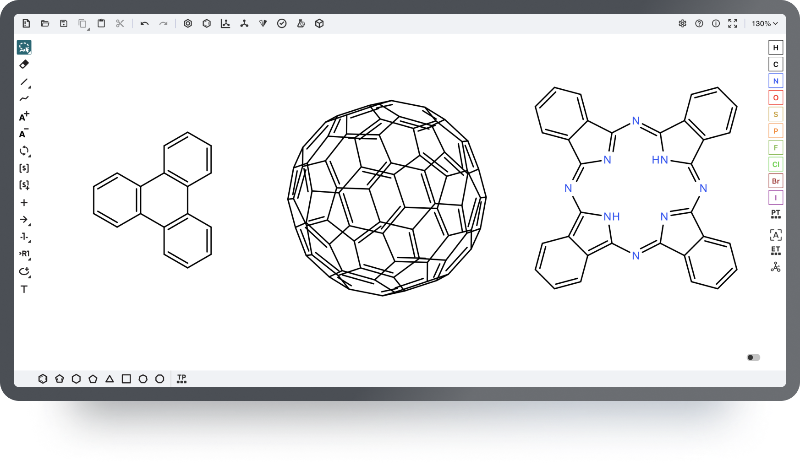

Ketcher
=======

.. toctree::
    :hidden:
    :includehidden:

    editing-tips
    developers-manual
    help
    demo
    release-notes/index
    Downloads <../download/ketcher>

Overview
--------

Ketcher is an open-source web-based chemical structure editor. Ketcher is designed for chemists, laboratory scientists and technicians who draw structures and reactions.

|image0|

Ketcher is developed using pure JavaScript and incorporates high performance, good portability and light weight. You will not need any Java or Flash plugins to use it in your browser. 

Ketcher is completely free and open-source, while also available on a commercial basis.

You can easily integrate Ketcher into your web application. Ketcher is actively developed and improved by the dedicated team. 
Explore the installation & integration information in our `repository <https://github.com/epam/ketcher#ketcher--->`__.

Provide your comments and suggestions and get timely replies from the developers’ team.

Other products & 3-rd party code
--------

Ketcher uses `Indigo Service <https://lifescience.opensource.epam.com/indigo/service/index.html>`__ for computationally intensive procedures.  

Ketcher leverages `Raphael <http://raphaeljs.com/>`_ framework to support objects rendering and representation on the canvas.

Standalone & Remote modes
--------

Ketcher is provided in 2 modes: *Standalone* and *Remote*. 

The *Standalone* mode incorporates Indigo backend services in the Ketcher build. It allows for Ketcher to work in browser with no server and even without the Internet connection. In this mode the pictures recognition provided by Indigo service is not available. 

The *Remote* mode requires Indigo server deployed and connected. It will provide all the Ketcher abilities leveraging Indigo. 

Main features
------------------------

**Fast and convenient editing.** We strive to make Ketcher as easy to use and as fast as the state-of-the-art desktop structure editing tools. Here are some highlights:

- Lasso     and Rectangle selection tools, plus a special Fragment selection tool to     deal with connected components, rather than single atoms/bonds.
- A     variety of `hotkeys <https://lifescience.opensource.epam.com/ketcher/editing-tips.html#hotkeys>`_
- Undo/Redo.
- Copy/Paste     for the canvas objects

**Atoms & Bonds**. Ketcher supports basic properties and query features, adding aliases and Generic group usage.

**Stereochemistry.** Ketcher provides complete stereochemistry support during the editing, loading, and saving of chemical structures.

**Reactions.** Full-featured reaction support including reacting centers, atom flags and AAM.

**S-groups.** All major S-group types are supported including generic, SRU polymers, multiple groups, superatoms and data S-groups.

**R-groups.** R-site and R-fragment assignment is supported, as well as attachment point specification and R-logic.

**Template library** (including custom and user's templates) & Functional groups support 

File formats supported
~~~~~~~~~~~~~~~~~~~~~~~~~~~~~~~~~~~~~~~~~~~~

Ketcher provides the ability to load and save structures and reactions in:

-  DL Molfile (v2000 and v3000)
-  RXN file format
-  InChI String
-  ChemAxon Extended SMILES
-  ChemAxon Extended CML file formats

Indigo service is used to provide the following computational tools for the canvas content:
~~~~~~~~~~~~~~~~~~~~~~~~~~~~~~~~~~~~~~~~~~~~~~~~~~~~~~~~~~~~~~~~~~~~~~~~~~~~~

• Aromatize/De-aromatize Tool
• Calculate CIP Descriptors Tool
• Structure Check Tool
• MW and Structure Parameters Calculate Tool
• Advanced Structure Clean up Tool (+ stereochemistry checking and structure layout)
• Simple Structure Clean up Tool (checks bonds length, angles and spatial arrangement of atoms)

Supported browsers
------------------
Ketcher is supported and tested in the majority of the modern browsers:

• Microsoft Edge 
• Mozilla Firefox
• Safari
• Chrome

Try Ketcher!
---------------
Explore Ketcher on the `demo <https://lifescience.opensource.epam.com/ketcher/demo.html>`__ page. 

Download
--------

Look at the `Downloads <../download/ketcher.html>`__ page for the
`installation <developers-manual.html#installation>`__ package and a
sample `Server v1 <developers-manual.html#ketcher-server>`__ , `Server v2 <../indigo/service/index.html>`__
implementation.

License
-------

Copyright © 2010-2022 LifeSciences unit of EPAM Systems, Inc.

Ketcher version 1.0 was released under GNU Affero General Public License v3.0
Ketcher version 2.0 was re-licensed under Apache License, Version 2.

This program is free software: You can redistribute it and/or modify it
under the terms of the the Apache License, Version 2.0.

You should have received a copy of the Apache License along
with this program. If you did not not, please see
https://www.apache.org/licenses/LICENSE-2.0

Feedback
--------

Do you need assistance using our tools? Do you need a feature? Do you
want to send a patch to us? Did you find a bug? Please use Github tickets package:

-  https://github.com/epam/ketcher/issues
-  https://github.com/epam/ketcher/discussions

Commercial Availability
-----------------------

The Apache License v2.0 allows Ketcher to be used as a component in proprietary software products.

If the Apache License v2.0 does not fit your needs, please contact us to discuss the purchase of a commercial license.
You may need the commercial license if you want to:

-  Receive ongoing support and maintenance
-  Design and implement custom changes for the structure editor
-  Do any other development/testing required for a proprietary software product

Visit our `SolutionsHub page <https://solutionshub.epam.com/solution/ketcher>`__   for more details

.. |ketcher2| image:: ../assets/ketcher/2.0.0-alpha.1+r78.png 

