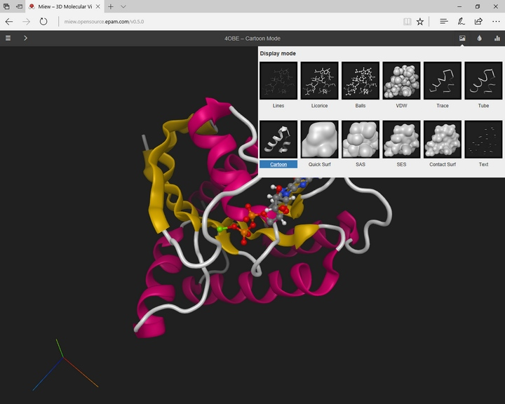
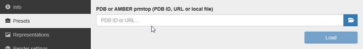
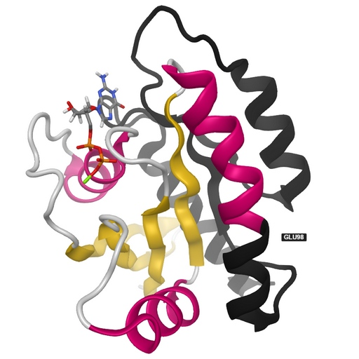

Miew – 3D Molecular Viewer
==========================

..  raw:: html

    

.. toctree::
    :hidden:
    :includehidden:

    embed
    selectors

Overview
--------

Miew is a high performance web tool for advanced visualization and manipulation of molecular structures.

It covers a wide range of applications in chemistry, pharmacy, biology, bioinformatics. Scientists and researchers can
examine molecular structure or properties, visualize ligand docking and protein folding, analyze mutations, and display
results in a friendly interactive environment.

Miew provides a full-featured set of tools for 3D visualization and editing of small molecules as well as large
molecular complexes, including means to view, analyze, and modify the 3D structure of a molecule. It works as a
standalone HTML5 web application or integrates as a component into your web pages.
The `latest versions <https://browsehappy.com/>`__ of WebGL-enabled desktop (Chrome, Firefox, Safari, Opera, Edge, IE11)
and mobile (iOS, Android) browsers are supported.

Miew is a `free and open-source <#license>`__ software.
Try the `Miew demo <http://miew.opensource.epam.com/>`__ online.

Note
~~~~

Miew is under active development. You can `post us your comments and suggestions <#feedback>`__ and get timely replies
from the developers' team.

Features
--------

Import data from Protein Bank, URL or local file
~~~~~~~~~~~~~~~~~~~~~~~~~~~~~~~~~~~~~~~~~~~~~~~~

You can fetch proteins right from `RCSB <http://www.rcsb.org/>`__ by their PDB ID, or retrieve 3D conformers of simpler
chemical structures from `PubChem <https://pubchem.ncbi.nlm.nih.gov/>`__. If you'd like to use a different server you
may specify a fully-qualified URL of the data file to load. You may also wish to browse to a local file on your
computer.

Visualize structures, electron density, dynamics results
~~~~~~~~~~~~~~~~~~~~~~~~~~~~~~~~~~~~~~~~~~~~~~~~~~~~~~~~

The data could be atom positions (PDB, CIF, MMTF, XYZ, SDF, CML), electron density fields (CCP4, MAP, MRC, DSN6), or atom trajectories.
The list of supported file formats is growing.

Examine a 3D molecular structure in various modes
~~~~~~~~~~~~~~~~~~~~~~~~~~~~~~~~~~~~~~~~~~~~~~~~~

Miew is capable of displaying a molecule using one of 10+ different modes including but not limited to Balls and Sticks,
Cartoon, Surface.

..  image:: ../assets/miew/miew-modes.jpg
    :align: center

Various coloring algorithms (by element, secondary structure, hydrophobicity, etc.) can be applied to each mode
increasing the number of combinations.

..  image:: ../assets/miew/miew-colors.jpg
    :align: center

User is free to combine different representations in one picture if that's what you need for your research. Just pick
atoms and/or residues with a mouse or use the specially designed selection language to extract certain parts of the
complex as a separate representation.

..  image:: ../assets/miew/miew-combinations.jpg
    :align: center

Execute commands in the built-in terminal
~~~~~~~~~~~~~~~~~~~~~~~~~~~~~~~~~~~~~~~~~

Simplify the creation of visual representations and fine-tune mode parameter using the scripting ability of Miew.
Get access to the rich API through the built-in command line.

..  image:: ../assets/miew/miew-terminal.jpg
    :align: center

Highlight sites of interest and attach annotations
~~~~~~~~~~~~~~~~~~~~~~~~~~~~~~~~~~~~~~~~~~~~~~~~~~

Use mode combinations to emphasize different parts of the structure for further analysis, presentation, etc.
The picture below shows GDP bound Human K-Ras
(PDB ID: `4OBE <http://www.rcsb.org/pdb/explore/explore.do?structureId=4obe>`__), E98* nonsense mutation is denoted by
black.

Share a link to visualizations created
~~~~~~~~~~~~~~~~~~~~~~~~~~~~~~~~~~~~~~

Your customization is encoded in a (long) URL ready to be passed to your colleagues. You can send the link as is, use a
third-party service to shorten it, and even generate QR-code.

..  figure:: ../assets/miew/miew-KRAS-E98-url.jpg
    :align: center

    `epa.ms/miew-kras <http://epa.ms/miew-kras>`__

Edit parts of the molecule
~~~~~~~~~~~~~~~~~~~~~~~~~~

Miew can run in EDIT mode which allows moving and rotating molecules and their fragments.

Integrate into your page or application
~~~~~~~~~~~~~~~~~~~~~~~~~~~~~~~~~~~~~~~

Embed the viewer into a DIV element of your web page, pass parameters via data attributes. You may also prefer to use
JavaScript API executing commands and showing exactly the picture you'd like to.

As an example, open `public NGB instance <http://ngb.opensource.epam.com/catgenome/#/GRCh38/6/117336964/117337328?tracks=%5B%7B%22b%22:%22GRCh38%22,%22p%22:%22SV_Sample2%22,%22h%22:20,%22s%22:%7B%7D%7D,%7B%22b%22:%22GRCh38_Genes%22,%22p%22:%22SV_Sample2%22,%22h%22:254,%22s%22:%7B%22g%22:%22collapsed%22%7D%7D,%7B%22b%22:%22sample_2-lumpy.vcf%22,%22p%22:%22SV_Sample2%22,%22h%22:131,%22s%22:%7B%22v%22:%22Collapsed%22%7D%7D,%7B%22b%22:%22sv_sample_2.bam%22,%22p%22:%22SV_Sample2%22,%22h%22:500,%22s%22:%7B%22a%22:true,%22aa%22:true,%22c%22:%22insertSize%22,%22c1%22:true,%22d%22:true,%22g1%22:%22chromosomeOfMate%22,%22i%22:true,%22m%22:true,%22r%22:0,%22s1%22:false,%22s2%22:true,%22s3%22:false,%22v1%22:false,%22cls%22:false,%22csm%22:%22default%22%7D%7D%5D>`__,
click on ROS1 gene track and select "Show 3D structure" from the context menu. MOLECULAR VIEWER panel appears allowing
you to examine the corresponding protein structure.

Augmented and Virtual Reality
-----------------------------

The team at EPAM Life Sciences has also developed `VR/AR molecular visualization apps <https://www.epam.com/ideas/videos/vr-ar-molecular-visualization-apps>`__.
These modern technologies provide a deeper immersion, thus giving scientists and researchers a better way of studying
and analyzing molecular structures.

..  raw:: html

    
    
<iframe src="https://www.youtube.com/embed/NhOl9mxTOMM"></iframe>

Even a web browser application can take advantage of AR/VR algorithms.

..  image:: ../assets/miew/miew-AR-VR.jpg
    :align: center

Source Code
-----------

Miew source code, documentation, and guides on how to get started with Miew are available at `GitHub <https://github.com/epam/miew>`__.

You may preview selected parts of the documentation here:

- `Embedding the Viewer <embed.html>`__
- `Selection Language <selectors.html>`__

License
-------

`MIT License <https://opensource.org/licenses/MIT>`__

Copyright (c) 2015-2019 EPAM Systems, Inc.

Permission is hereby granted, free of charge, to any person obtaining a copy
of this software and associated documentation files (the "Software"), to deal
in the Software without restriction, including without limitation the rights
to use, copy, modify, merge, publish, distribute, sublicense, and/or sell
copies of the Software, and to permit persons to whom the Software is
furnished to do so, subject to the following conditions:

The above copyright notice and this permission notice shall be included in all
copies or substantial portions of the Software.

THE SOFTWARE IS PROVIDED "AS IS", WITHOUT WARRANTY OF ANY KIND, EXPRESS OR
IMPLIED, INCLUDING BUT NOT LIMITED TO THE WARRANTIES OF MERCHANTABILITY,
FITNESS FOR A PARTICULAR PURPOSE AND NONINFRINGEMENT. IN NO EVENT SHALL THE
AUTHORS OR COPYRIGHT HOLDERS BE LIABLE FOR ANY CLAIM, DAMAGES OR OTHER
LIABILITY, WHETHER IN AN ACTION OF CONTRACT, TORT OR OTHERWISE, ARISING FROM,
OUT OF OR IN CONNECTION WITH THE SOFTWARE OR THE USE OR OTHER DEALINGS IN THE
SOFTWARE.

Feedback
--------

Do you need assistance with our tools? Do you need a feature? Do you want to send a patch to us? Did you find a bug?
`Report issues at GitHub <https://github.com/epam/miew/issues>`__ or contact us directly at miew@epam.com
