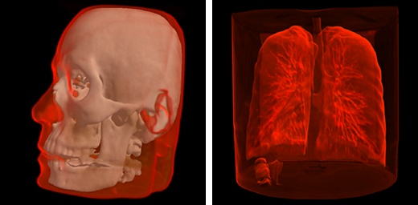
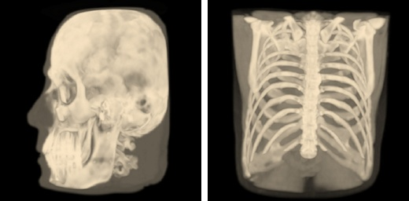

Web3D DICOM Viewer
==================

..  raw:: html

    

.. toctree::
    :hidden:
    :includehidden:

    papers

Overview
--------

Web3D DICOM Viewer creates a 3D model of a body part based on the set of plane images (DICOM, NIfTI, etc. file formats)
and shows 2D/3D views via a web browser without any installations. Web3D DICOM Viewer will please you with speed and
convenience in comparison even with desktop analogues. Fast smooth 3D visualization based on unique rendering algorithms
developed at EPAM, which don't require data preprocessing, thus visualization starts right after the data loading.

EPAM DICOM 3D Viewer is a `free and open source <#license>`__ software.

Try the DICOM 3D Viewer online --- `epa.ms/mri <http://epa.ms/mri>`__.

**We have not found similar web-tool.** We have developed `unique optimization of isosurface rendering algorithm <papers.html>`__.

Key Features
------------

1. DICOM, NIfTI, KTX formats support.
2. 5 view modes, 3D and 2D visualization.
3. Real-time adjustment of Isosurface and transfer function levels in 3D views.
4. Measurement of distances, angles, areas in 2D views.
5. Viewing sample in any standard projection.
6. DICOM tags displaying.
7. Real time volume clipping to open areas of interest.
8. Javascript + WebGL.

Fast and Comfortable
--------------------

1. Simple user interface without rarely-used functions.
2. Combined surface and volume visualization mode.
3. Support for diverse data sources: a local computer, CD/DVD, a server, or a cloud.
4. No installation on a user computer required.
5. Compatibility with all popular desktop OSs.

Simple User Interface
---------------------

The functionality depends on the selected visualization mode (2D or 3D), and in case of 3D mode on the selected
visualization method. There is a 3D visualization mode with a volume render method on the screenshot below. In this case
the interface provides the ability to select areas of interest inside the volume, brightness and contrast adjustment, as
well as the ability to use the near clipping plane position.

..  image:: ../assets/mri/mri-ui.jpg
    :align: center

3D Visualization
----------------

Isosurface visualization
~~~~~~~~~~~~~~~~~~~~~~~~

This method suits for bones, skin surface and segmented areas visualization. The base of this method is a search of the
intersection points between the rays corresponding to pixels and the isosurface. The user selects the level of the
isosurface and the near clipping plane position with sliders.

..  image:: ../assets/mri/mri-surf.jpg
    :align: center

Volume visualization
~~~~~~~~~~~~~~~~~~~~

This method suits for studying the initial data volume and the soft tissues visualization. It allows to choose an area
of the interest by specifying the transfer function, which assigns the amount of the initial data to the amount of the
transparency and color. To simplify the transfer function, the user uses a function in the application, which he can
define by adjusting three parameters (a, b and c) with sliders. The function is nonzero only if the intensity *i*
satisfies the conditions *a < i < b* or *i > c*. When the function satisfies the first condition, the user can determine
the transparency value by the value of the additional slider, and when it satisfies the second, the transparency value
is considered equal to 1. Such a subset of transfer functions is sufficient to visualize the overwhelming array of
medical data. The base of this method is the calculation of the volume integral along the rays passing through the
pixels.

Max Intensity Projection (MIP)
~~~~~~~~~~~~~~~~~~~~~~~~~~~~~~

The method suits for the primary analysis of the initial data, as it does not require setting of values of any
parameters. The bas of this method is the computation of the maximum values of the intensities of the original data
along the rays passing through the pixels.

2D Visualization
----------------

Use this mode to view raw data sections in different projections and to measure the linear and angular dimensions of
fragments of this data.

..  image:: ../assets/mri/mri-2d.jpg
    :align: center

DICOM Tags
----------

DICOM Tags contain information about the source data such as patient data, date of data production, distance between
images, and so on.

..  image:: ../assets/mri/mri-tags.jpg
    :align: center

Try in One Click
----------------

You can try the `Web3D DICOM Viewer demo <http://epa.ms/mri>`__ online. But please be informed, that not all browsers
and video cards are supported yet.

The product is under development. More features to come in future releases: automated segmentation, volume cut,
automated ROI detection, and complex colored transfer functions, etc.

Source Code
-----------

Web3D DICOM Viewer is under active development and its source code is available at `GitHub <https://github.com/epam/med3web>`__.

License
-------

Copyright 2016-2018 EPAM Systems, Inc.

Licensed under the Apache License, Version 2.0 (the "License");
you may not use this file except in compliance with the License.
You may obtain a copy of the License at

    http://www.apache.org/licenses/LICENSE-2.0

Unless required by applicable law or agreed to in writing, software
distributed under the License is distributed on an "AS IS" BASIS,
WITHOUT WARRANTIES OR CONDITIONS OF ANY KIND, either express or implied.
See the License for the specific language governing permissions and
limitations under the License.

Feedback
--------

Do you need assistance with our tools? Do you need a feature? Do you want to send a patch to us? Did you find a bug?
`Report issues at GitHub <https://github.com/epam/med3web/issues>`__ or contact us directly at mri@epam.com
