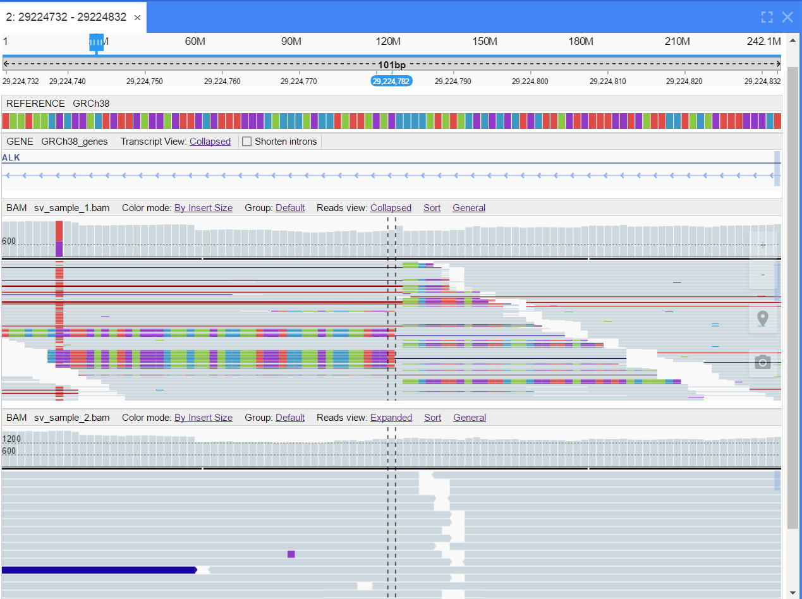
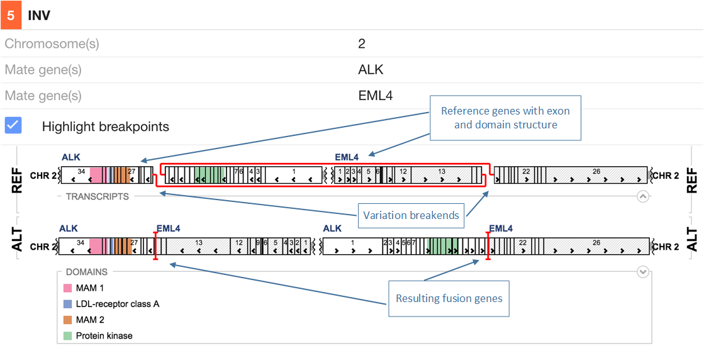
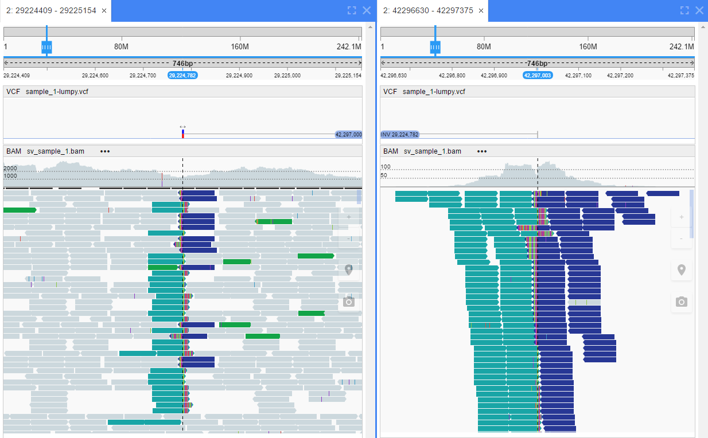

New Genome Browser - NGB
========================

Web at a speed and functionality of a powerful desktop

Overview
--------

NGB is a genome browser working via Web on virtually any computer, requiring no installations / updates and providing the functionality and speed compared to the best desktop genome browsers.

Key Features
------------

-  `Alignments`_ and `variations`_ visualization
-  Visualization of `Structural Variations`_ (SVs) and their supporting reads
-  `RNASeq-specific`_ visualization
-  Embedded `protein structure viewer`_
-  Integration with ENSEMBL, UniPROT, etc. and internal databases
-  CRAM format support

Fast and comfortable 
--------------------

-  `Split-view`_ of extensive genomic rearrangement
-  “Variants” table for rapid review of filtered subsets of variants
-  Fast and scalable big/cloud genome data analysis
-  Hotkeys for fast sorting, grouping, coloring, scaling, etc.
-  Dockable panels, saving and sharing sessions, etc.
-  Fast access to huge (500 Gb and more) data files
-  Easy access to cloud data (Amazon S3, Hadoop, etc.)

.. _`Alignments`:

Alignment visualization
-----------------------

NGB provides a rich set of tools for viewing alignments in BAM/CRAM format:

-  Responsive visualization up to 150 kb
-  Collapsed view for high-coverage samples (one-pixel height read)
-  Sorting and grouping reads by chromosome of mate, pair orientation, insert size, base, etc.
-  Coloring reads by read strand, pair orientation, insert size, first in pair strand, etc.
-  Softclipped reads
-  Coverage visualization

|alignments|

.. _`variations`:

Variation visualization
-----------------------

NGB has set of powerful mechanisms to simplify working with variations: searching, analyzing and reporting.

-  “Variants” table for quick filtering/search by wide set of fields
-  Jump between variations using arrow buttons/keys
-  Grouped/stacked variations view on small scale
-  Detailed variation info on demand (screenshot!)
-  Links to external databases (dbSNP, etc.)
-  Viewing variation effect on protein domains

|variations|

.. _`Structural Variations`:

Structural variations visualization
-----------------------------------

Alongside with common variations NGB supports structural variations according to VCF4.3 format: Long insertions and deletions, inversions, breakpoins. NGB also provides several very useful visualizations for structural variations.

-  Variation type size and direction
-  Detailed variation info including the table view for ANN field
-  Displaying fusion proteins with domains/exons structure
-  Visualizing the DNA rearrangement and the resulting hybrid proteins/domains/exons
-  NGB downloads information about protein domains from Uniprot database and displays domain structure on rearrangement scheme

|inv_comment|
|inv_support|

.. _`Split-view`:

Split-view mode
---------------

NBG can show data at two locations simultaneously for effective analysis of extensive genomic rearrangements. User can easily open split view for viewing mate reads or both end of a structural variation, or just open split view for any desired location.
The position, scale and track mode can be set up for each view independently.

|NGB_splitview|

.. _`RNASeq-specific`:

RNASeq
------

NGB has special modes for working with RNAseq data, including split reads and spice junctions.

Shorten introns (exome only) view hides all introns (except short flanking regions) and shows only a part of a reference that corresponds to gene exons.

.. list-table:: 
   :header-rows: 0
   :stub-columns: 0
   :widths: 70 70

   * - |NGB_RNASeq1|
     - |NGB_RNASeq2|

.. _`protein structure viewer`:

Integrated protein structure viewer
-----------------------------------

Embedded molecular viewer showing proteins that correspond to genes/transcripts displayed in genome browser and highlighting regions of interest, e.g. mutations, domains, etc.

|NGB_proteinviewer|

Try in one click
----------------

You can try the `NGB demo <http://ngb.opensource.epam.com/catgenome>`__
But please be informed, that not all browsers are supported

License
-------

Copyright © 2010-2017 LifeSciences unit of EPAM Systems, Inc.

EPAM NGB is licensed under the MIT License.
A short and simple permissive license with conditions only requiring preservation of copyright and license notices. Licensed works, modifications, and larger works may be distributed under different terms and without source code.

Permissions

-  Commercial use 
-  Modification 
-  Distribution 
-  Private use 

Conditions

-  License and copyright notice 

Limitations

-  Liability 
-  Warranty 

This program is distributed in the hope that it will be useful, but
WITHOUT ANY WARRANTY; without even the implied warranty of
MERCHANTABILITY or FITNESS FOR A PARTICULAR PURPOSE. See the GNU Affero
General Public License for more details.

MIT License

Copyright (c) 2016 EPAM Systems
Permission is hereby granted, free of charge, to any person obtaining a copy
of this software and associated documentation files (the "Software"), to deal
in the Software without restriction, including without limitation the rights
to use, copy, modify, merge, publish, distribute, sublicense, and/or sell
copies of the Software, and to permit persons to whom the Software is
furnished to do so, subject to the following conditions:
The above copyright notice and this permission notice shall be included in all
copies or substantial portions of the Software.
THE SOFTWARE IS PROVIDED "AS IS", WITHOUT WARRANTY OF ANY KIND, EXPRESS OR
IMPLIED, INCLUDING BUT NOT LIMITED TO THE WARRANTIES OF MERCHANTABILITY,
FITNESS FOR A PARTICULAR PURPOSE AND NONINFRINGEMENT. IN NO EVENT SHALL THE
AUTHORS OR COPYRIGHT HOLDERS BE LIABLE FOR ANY CLAIM, DAMAGES OR OTHER
LIABILITY, WHETHER IN AN ACTION OF CONTRACT, TORT OR OTHERWISE, ARISING FROM,
OUT OF OR IN CONNECTION WITH THE SOFTWARE OR THE USE OR OTHER DEALINGS IN THE
SOFTWARE.

Source code and Quick start guide
---------------------------------

NGB source code, documentation, guides how to build and start NGB is accessible at the web-based hosting service Github - https://github.com/epam/NGB

Feedback
--------

Do you need assistance using our tools? Do you need a feature? Do you
want to send a patch to us? Did you find a bug? 
Report issues to https://github.com/epam/NGB/issues or contact us: NGB@epam.com

.. |variations| image:: ../assets/ngb/NGB_variations.PNG

.. |NGB_splitview| image:: ../assets/ngb/NGB_splitview.PNG
.. |NGB_RNASeq1| image:: ../assets/ngb/NGB_RNASeq1_small.PNG
.. |NGB_RNASeq2| image:: ../assets/ngb/NGB_RNASeq2_small.PNG
.. |NGB_proteinviewer| image:: ../assets/ngb/NGB_proteinviewer.PNG

